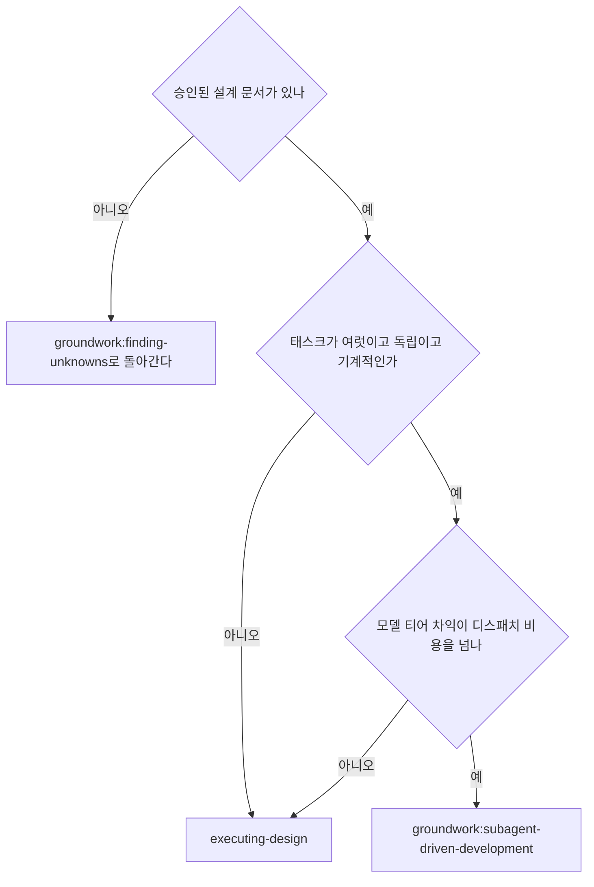

# executing-design

승인된 설계 문서를 읽고 태스크로 쪼갠 뒤 태스크마다 구현과 리뷰를 붙여 끝까지 실행한다.

설계 문서는 실행 단계에 계약으로 작동한다.
무엇을 만들고 무엇이 되면 끝인지를 정하되 어떤 순서로 어느 파일을 건드릴지는 정하지 않는다.
분해는 이 스킬이 착수 시점에 한다.

## 실행 계약

**입력**: 실행할 설계 문서 파일의 경로 하나를 호출자에게 받는다.
`groundwork:finding-unknowns`(설계 문서를 쓰고 승인까지 받는 설계 진입 스킬)가 승인된 설계 문서를 넘길 때 그 경로를 준다.
경로를 받지 못했으면 어느 설계 문서를 실행할지 사용자에게 묻는다.
임의로 찾아 고르지 않는다.
아래 본문에서 `DESIGN_FILE`은 그 경로를 가리키는 이름이고 셸 변수가 아니다.
셸 커맨드에 넣을 때는 그 자리에 실제 경로를 적는다.

**주체**: 이 스킬을 실행하는 너를 `실행자`라 부른다.
구현은 실행자가 직접 하고 `리뷰어`만 서브에이전트로 띄운다.
`사용자`는 설계 문서를 승인한 사람이다.

**경로 기준**: 이 문서의 상대 경로는 두 기준으로 갈린다.
`scripts/...`와 마크다운 링크는 이 스킬 디렉터리 `${CLAUDE_PLUGIN_ROOT}/skills/executing-design/` 기준이고, 그 아래 `scripts/`와 리뷰어 프롬프트 파일이 실재한다.
`${CLAUDE_PLUGIN_ROOT}`는 groundwork 플러그인이 설치된 디렉터리이지 실행 시점 작업 디렉터리가 아니다.
워크스페이스와 코드 산출물 경로는 대상 repo 루트 기준이다.

**출력**: 전 태스크를 마치면 무엇을 구현했고 어느 검증이 통과했는지 사용자에게 보고한다.
설계 문서와 달라진 지점이 있으면 그것도 적는다.
그 뒤 통합 결정은 `groundwork:finish`(머지·PR·보관을 정하고 산출물에 종료 표기를 남기는 스킬)로 넘긴다.
중간에 끝나면 어디까지 했고 무엇에 막혔는지를 같은 형식으로 보고한다.

**연속 실행**: 태스크 사이에 사용자에게 확인하려 멈추지 않는다.
멈추는 이유는 3가지뿐이다.
해소할 수 없는 막힘, 진행을 정말로 막는 모호함, 전 태스크 완료.
"계속할까요?" 같은 확인과 진행 요약은 사용자의 시간을 버린다.

## 적용 판단

이 스킬이 설계 실행의 기본 경로다.
실행자가 직접 구현하고 리뷰만 격리한다.

격리의 값어치가 리뷰에만 있기 때문이다.
구현에서 격리는 비용이다.
실행자는 설계 문서와 앞 태스크에서 내린 판단을 이미 알고 있고, 그것을 버린 뒤 디스패치 프롬프트로 부분 복원하면 버린 것보다 적게 복원된다.
리뷰에서 격리는 효용이다.
리뷰어가 구현 추론을 안 봤다는 사실 자체가 판정의 근거이고, 같은 컨텍스트 안에서는 독립 판정이 원리적으로 불가능하다.

`groundwork:subagent-driven-development`(태스크마다 fresh 구현자 서브에이전트를 띄우는 실행 스킬)로 넘기는 조건은 셋이고 전부 만족할 때만 넘긴다.

- 태스크가 여럿이고 서로 독립이다
- 태스크가 기계적이라 더 약한 모델로 내려도 된다
- 모델 티어 차익이 디스패치 오버헤드를 넘는다

셋 중 하나라도 어긋나면 이 스킬로 실행한다.
판단이 서지 않으면 이 스킬을 쓴다.

## 셋업

작업이 격리된 워크스페이스에서 일어나게 한다.
`groundwork:using-git-worktrees`(격리 워크스페이스를 확보하는 스킬)로 만들거나 기존 것을 확인한다.
사용자의 명시 동의 없이 main·master 브랜치에서 구현을 시작하지 않는다.

**진행 기록 파일이 필요한 이유는 판정의 보존이다.**
어느 태스크까지 끝났는지는 todo와 `git log`가 이미 담는다.
파일이 아니면 남지 않는 것은 따로 있다.
보류한 Minor, 상한에서 내린 판정과 그 근거, 막힘 사유다.
이 셋은 4단계의 최종 리뷰가 읽어야 하는데 커밋에도 todo에도 들어가지 않는다.

컨텍스트 압축이 그것을 지운다.
압축은 대화가 길어질 때 실행 환경이 앞선 대화를 요약으로 대체하는 동작이고, 그때 판정 근거 같은 세부가 먼저 사라진다.
분해 결과도 커밋되는 문서로 남지 않으므로 같은 이유로 여기 적는다.

- 설계 문서마다 워크스페이스 하나다.
  `scripts/design-workspace DESIGN_FILE`을 돌리면 그 설계 문서의 git-ignore된 디렉터리(`<repo-root>/.groundwork/run/<설계 문서 파일명에서 확장자를 뺀 값>/`)를 만들고 절대 경로를 출력한다.
  이 설계 문서의 모든 단명 산출물(진행 기록·리뷰 패키지)이 거기 모인다.
  다른 설계 문서의 디렉터리는 읽지도 쓰지도 않는다.
- `<workspace>/progress.md`에 이 설계 문서의 진행 기록이 있는지 확인한다.
  첫 줄이 네 설계 문서 파일을 가리키면 `태스크 <N>: 완료` 줄이 있는 태스크는 끝난 것이다.
  다시 실행하지 않고 그 줄이 없는 첫 태스크에서 재개한다.
  첫 줄이 다른 설계 문서를 가리키는 진행 기록은 남의 진행이다.
  그대로 두고 자기 것을 새로 연다.
- 진행 기록을 만들 때 첫 줄에 정체를 적는다: `# 진행 기록 — 설계: <설계 문서 파일 경로>`.
  아래 「태스크로 분해한다」에서 확정한 태스크 목록을 그 다음에 적는다.
  분해는 커밋되는 문서로 남지 않으므로 진행 기록에 적지 않으면 재개 지점이 사라진다.
- 압축 이후에는 자기 기억보다 진행 기록과 `git log`를 믿는다.
- `git clean -fdx`(git이 추적하지 않는 파일을 무시 목록까지 포함해 지우는 커맨드)는 이 워크스페이스를 파괴한다.
  그렇게 지워졌으면 `git log`의 커밋 메시지로 어디까지 끝났는지 재구성해 진행 기록을 다시 연다.

## 설계 문서를 읽고 검토한다

설계 문서 전문을 읽는다.
범위·제외 범위·수용 기준·전역 제약을 파악한다.
이 네 절의 정의는 `groundwork:finding-unknowns`의 「설계 문서에 담는 것」이 정본이다.

비판적으로 훑어 충돌을 찾는다.

- 설계 문서 안에서 서로 모순되는 요구
- 설계 문서가 명시로 요구하는데 코드 리뷰 기준이 결함으로 보는 것(아무것도 단언하지 않는 테스트, 로직 블록을 그대로 복제한 것)
- 수용 기준이 판정 불가능한 형태로 적힌 것

찾은 것을 **한 번에 묶어** 사용자에게 묻는다.
발견마다 그것을 요구하는 설계 문서의 텍스트를 나란히 두고 어느 쪽이 우선인지 묻는다.
실행 시작 전에 한 번이고 진행 중 발견마다 끼어드는 것이 아니다.
훑어서 깨끗하면 아무 말 없이 진행한다.

설계 문서가 독립 서브시스템 여럿을 덮으면 설계 단계에서 갈렸어야 한다.
갈리지 않은 채 넘어왔으면 서브시스템마다 별도 설계 문서으로 쪼갤 것을 제안한다.

## 태스크로 분해한다

분해는 커밋되는 문서가 아니라 todo와 진행 기록으로 남는다.
사용자 승인을 거치지 않으므로 착수 전에 결과를 대화에서 한 번 짚는다(아래 「분해 통지」).

### 파일 구조를 먼저 그린다

태스크를 가르기 전에 어느 파일이 생기고 바뀌는지, 각 파일이 무엇을 책임지는지 정한다.
분해 결정이 여기서 확정된다.

- 경계가 뚜렷하고 인터페이스가 명확한 단위로 설계한다.
  파일 하나가 책임 하나를 진다.
- 한 컨텍스트에 담기는 코드일수록 판단이 정확하고 편집이 안정된다.
  너무 많은 일을 하는 큰 파일보다 초점이 좁은 작은 파일을 택한다.
- 함께 바뀌는 파일은 함께 둔다.
  기술 계층이 아니라 책임으로 가른다.
- 기존 코드베이스에서는 확립된 패턴을 따른다.
  코드베이스가 큰 파일을 쓴다면 독단으로 재구조화하지 않는다.
  수정 대상 파일이 이미 감당하기 어렵게 커졌을 때만 분할을 태스크에 넣는다.

### 태스크 경계를 정한다

태스크는 자기 테스트 사이클을 지니고 리뷰어의 게이트를 받을 가치가 있는 최소 단위다.
셋업·설정·스캐폴딩·문서 작업은 그것이 필요한 산출물의 태스크 안에 넣는다.
리뷰어가 이웃 태스크를 승인하면서 이 태스크만 의미 있게 반려할 수 있는 지점에서만 가른다.

**태스크 경계는 빌드·테스트 통과 지점이다.**
각 태스크가 끝난 시점에 작업 트리 전체가 독립으로 빌드·테스트를 통과해야 한다.
중간이 통과하지 않는 강결합은 한 태스크로 합친다.
쪼개지지 않는다는 사실 자체가 병합 신호다.
빌드·테스트 인프라가 없는 리포에서는 무엇이 통과를 뜻하는지 먼저 정하고 진행 기록에 적는다.

### 태스크마다 확정할 것

todo 항목 하나에 다음이 들어간다.

- 건드리는 파일과 각 파일에서 무엇을 추가·변경·삭제하는지
- 이 태스크가 앞 태스크에서 쓰는 것과 뒤 태스크에 넘기는 것. 정확한 함수명·파라미터·반환 타입으로 적는다
- 실행 검증 커맨드. 그 태스크의 산출물을 실제로 판정하는 것이어야 하고 무엇을 해도 통과하는 커맨드는 검증이 아니다
- 선행 태스크

기존 파일은 심볼명으로 지정하고 라인 번호는 쓰지 않는다.
라인 번호는 코드가 바뀌면 곧 어긋나고 언어 서버는 심볼로 이동하므로 라인 병기는 조회 낭비를 낳는다.

### 분해가 미완이라는 신호

아래가 남아 있으면 아직 분해가 끝나지 않은 것이다.
착수하기 전에 없앤다.

- "TBD", "TODO", "나중에", "세부는 채워 넣기"
- "적절한 에러 처리 추가", "검증 추가", "엣지케이스 처리"
- 무엇을 할지만 있고 어떻게 할지가 없는 태스크
- 어느 태스크에서도 정의하지 않는 타입·함수·메서드 참조
- 검증 커맨드가 없는 태스크

### 리서치 경계

- 심볼·시그니처는 Read와 언어 서버로 실측한다.
  추정하지 않는다.
- 설계 문서가 결정한 기술의 세부는 공식 문서로 조회한다.
- 설계 문서에 없는 기술 선택·가정은 조사로 메우지 않는다.
  설계 문서로 회귀한다.

### 분해 통지

착수 전에 태스크 제목과 각 태스크가 끝나면 무엇이 동작하는지를 대화에 한 줄씩 짚는다.
설계 문서에서 확정한 범위 항목이 어느 태스크로 갔는지 보인다.

이것은 게이트가 아니다.
답을 기다리지 않고 곧바로 착수한다.
사용자가 판정할 수 있는 것은 분해의 기술적 타당성이 아니라 자기가 원한 것이 빠지지 않았는가이고, 그 판정 기회를 주되 진행을 막지는 않는다.
사용자가 빠진 것을 짚으면 그 자리에서 분해를 고친다.

파일을 만들지 않는다.
설계 문서 원문은 그대로이고 사용자는 경로로 언제든 전문을 본다.

## 태스크 루프

태스크마다 아래 네 절을 순서대로 돈다.

### 구현한다

todo를 in_progress로 표시하고 직접 구현한다.

구현 전에 이 태스크의 시작 커밋을 기록한다(`git rev-parse HEAD`).
아래에서 `BASE`는 그 값이고 리뷰 패키지가 이 값을 쓴다.

자동 테스트로 검증할 수 있는 태스크는 `groundwork:test-driven-development`(테스트를 먼저 쓰게 강제하는 스킬)를 따른다.
각 단계는 행동 하나이고 2분에서 5분 규모다.

- 실패하는 테스트를 쓴다
- 실행해 실패를 확인한다
- 통과시킬 최소 구현을 쓴다
- 실행해 통과를 확인한다
- 커밋한다

버그를 만나면 `groundwork:systematic-debugging`(근본 원인을 찾게 강제하는 스킬)을 따른다.
완료를 주장하기 전에 `groundwork:verification-before-completion`(검증 커맨드를 돌려 출력을 확인하게 강제하는 스킬)을 따른다.

구현을 마치면 이 태스크의 마지막 커밋을 기록한다.
아래에서 `HEAD`는 그 값이다.

### 리뷰 게이트를 건다

태스크 리뷰는 태스크 범위의 게이트다.
브랜치 전체를 보는 판정은 아래 「최종 리뷰」에서 한 번 일어난다.
**태스크 리뷰를 건너뛰지 않는다.**
자기 구현을 자기가 검토한 것은 리뷰가 아니다.
같은 컨텍스트 안에서는 코드가 아니라 자기 의도를 읽게 된다.

- 리뷰어에게 diff를 파일로 넘긴다.
  `scripts/review-package DESIGN_FILE BASE HEAD`를 돌리고 출력된 경로를 넘긴다.
  그 출력은 실행자 컨텍스트에 들어오지 않고 리뷰어는 커밋 목록·변경 파일 요약·문맥 포함 전체 diff를 한 번의 Read로 본다.
  diff 파일 없이 리뷰어를 디스패치하지 않는다.
- 리뷰어에게 넘기는 것은 셋이다.
  리뷰 패키지 경로, 이 태스크가 무엇을 해야 했는지, 설계 문서에서 이 태스크를 구속하는 요구를 그대로 복사한 제약 블록이다.
  제약 블록에는 정확한 값, 정확한 형식, 컴포넌트 사이의 관계 진술("X와 같은 레이아웃", "Y와 일치")을 담는다.
  프로세스 규칙(불필요한 기능 배격·테스트 위생·리뷰 방법)은 리뷰어 템플릿이 이미 담고 있으므로 제약 블록에 넣지 않는다.
- 리뷰어는 두 판정을 낸다.
  설계 준수와 태스크 품질이다.
  둘 중 하나가 빠진 리포트를 받지 않는다.
- 구체적이고 태스크에 국한된 이유 없이 "모든 사용처를 확인하라" 같은 열린 지시를 더하지 않는다.
- 실행자가 이미 돌린 테스트를 리뷰어에게 다시 돌리라고 하지 않는다.
- **리뷰어를 위해 발견을 미리 판정하지 않는다.**
  오탐이라고 생각하면 리뷰어가 제기하게 두고 아래 fix 루프에서 판정한다.
  실행자가 쓰는 프롬프트에 "표시하지 마라", "X를 결함으로 보지 마라", "최대 Minor로"가 들어 있으면 멈춘다.
  리뷰 루프를 아끼려고 미리 판정하는 중이다.
- **리뷰어마다 모델을 명시해 띄운다.**
  티어는 [choosing-model-tier.md](../using-groundwork/choosing-model-tier.md)의 「코드 리뷰 태스크」에 있다.
  모델을 빠뜨리면 세션 모델을 상속하고 그것은 대개 가장 비싼 모델이다.

리뷰어에게 주입할 지시 전문은 [task-reviewer-prompt.md](task-reviewer-prompt.md)에 있다.

리뷰어가 "diff만으로 검증 불가" 항목을 보고할 수 있다.
바뀌지 않은 코드에 있거나 태스크를 가로지르는 요구다.
리뷰어에게 없는 설계 문서와 태스크 간 컨텍스트를 실행자가 안다.
실제 공백으로 확인되면 설계 준수 실패로 취급해 다른 발견들과 함께 fix 루프에 넣는다.

### fix 루프

리뷰가 설계 불합격을 내거나 Critical·Important 발견이 있거나 실행자가 실제 공백으로 확인한 "검증 불가" 항목이 있으면 루프가 돈다.
`Critical`·`Important`·`Minor`는 리뷰어 템플릿이 정한 심각도 등급이고 정의는 그 템플릿에 있다.

루프가 시작되기 전에 두 경로가 즉시 빠져나간다.

- Minor 발견은 진행하며 진행 기록에 적는다(`태스크 <N>: minor(보류): <한 줄>`).
  「최종 리뷰」가 그 목록을 보고 머지 전에 무엇을 고쳐야 할지 분류한다.
  Minor는 루프에 들어가지 않는다.
- 리뷰어가 `design-mandated`(설계 문서가 그렇게 하라고 요구했다)로 표시한 발견, 그리고 설계 문서의 텍스트가 요구하는 것과 충돌하는 발견은 사용자의 결정이다.
  발견과 설계 문서의 텍스트를 제시하고 어느 쪽이 우선인지 묻는다.
  설계 문서가 요구한다는 이유로 발견을 기각하지 않고 묻지 않은 채 설계 문서에 반하는 수정을 하지도 않는다.

나머지는 루프에 들어간다.
한 라운드는 수정 하나 + 범위 한정 재리뷰 하나다.
태스크당 최대 3라운드다.

**매 라운드**: 실행자가 고친다.
그다음 수정한 코드를 덮는 테스트를 다시 돌린다.
재리뷰를 디스패치하기 전에 덮는 테스트·돌린 커맨드·출력 3가지를 확인한다.

**재리뷰는 범위가 한정된다.**
`scripts/review-package DESIGN_FILE FIX_BASE HEAD`를 돌린다.
`FIX_BASE`는 직전 리뷰가 본 마지막 커밋이다.
[re-review-prompt.md](re-review-prompt.md)에 발견 목록과 출력된 diff 경로를 실어 디스패치한다.
재리뷰어는 발견마다 해소됐는지 판정하고 수정 diff 안의 새 파손만 표시한다.
수정 diff의 새 Critical·Important 파손은 열린 발견 목록에 합류한다.
범위 밖 관찰은 보류 minor로 진행 기록에 간다.
루프를 연장하지 않는다.

**라운드마다** 진행 기록에 덧붙인다: `태스크 <N>: fix 라운드 <R>/3 (<X>개 해소, <Y>개 열림 — <발견 한 줄들>. 커밋 <base7>..<head7>)`

3라운드 재리뷰에도 발견이 열린 채면 멈추고 실행자가 직접 판정한다.
리뷰어에게 없는 설계 문서와 태스크 간 컨텍스트를 실행자가 안다.

- **리뷰어가 틀렸거나 논쟁의 여지가 있다**: 보류한다.
  `태스크 <N>: 보류 — <발견> — 판정: <왜 코드가 유지되는가>`.
  최종 리뷰가 양쪽을 본다.
- **실제 문제지만 뒤 작업이 그 위에 쌓이지 않는다**: 같은 방식으로 보류하되 실제이고 이월했다는 판정을 적는다.
- **실제이고 뒤 작업이 그 위에 쌓인다**(설계 결함을 드러내는 경우도 여기다): 멈춘다.
  `태스크 <N>: 막힘 — <이유>`를 덧붙이고 발견·충돌하는 설계 문서의 텍스트·수정 이력과 함께 사용자에게 보고한다.
  구조적 실패를 보류하면 모든 의존 태스크가 그 위에 쌓이고 최종 리뷰도 고칠 수 없는 문제를 떠안는다.

판정은 3라운드 상한에서만 한다.
루프를 끝내려고 일찍 판정하는 것은 이름만 다른 미리 판정이다.
모든 판정은 진행 기록 항목이다.
조용한 폐기는 금지다.

### 태스크를 완료한다

리뷰가 깨끗하게 돌아오거나 상한에서 열린 발견이 전부 판정과 함께 보류되면 완료 줄을 진행 기록에 덧붙인다.

- `태스크 <N>: 완료 (커밋 <base7>..<head7>, 리뷰 깨끗)`
- 상한 판정을 거친 뒤라면 `태스크 <N>: 완료 (커밋 <base7>..<head7>, <K>개 보류)`

그다음 todo를 완료로 표시하고 다음 태스크로 간다.
리뷰에 열린 Critical·Important가 있는데 고쳐지지도 상한에서 판정과 함께 보류되지도 않았다면 다음 태스크로 가지 않는다.

## 최종 리뷰

최종 리뷰도 패키지를 받는다.
`scripts/review-package DESIGN_FILE MERGE_BASE HEAD`를 돌리고 출력된 경로를 디스패치에 넣는다.
`MERGE_BASE`는 이 브랜치가 갈라져 나온 커밋이고 `git merge-base main HEAD`로 구한다(기본 브랜치 이름이 다르면 그 이름을 쓴다).
최종 리뷰어가 git 커맨드로 브랜치 diff를 다시 만들지 않고 파일 하나를 읽는다.

가장 유능한 모델로 디스패치하고 `groundwork:requesting-code-review`(코드 리뷰어를 디스패치하는 스킬)의 [code-reviewer-prompt.md](../requesting-code-review/code-reviewer-prompt.md)를 주입한다.
진행 기록의 보류 minor와 보류 항목 줄을 가리켜 머지 전에 무엇을 고쳐야 할지 분류하게 한다.

최종 리뷰가 낸 발견은 실행자가 한 묶음으로 고친다.
발견마다 따로 처리하지 않는다.
그다음 수정 묶음의 범위 한정 재리뷰를 정확히 한 번 돌린다(`scripts/review-package DESIGN_FILE FIX_BASE HEAD`와 [re-review-prompt.md](re-review-prompt.md)).

남은 발견은 「fix 루프」의 상한 판정과 같은 방식으로 판정한다.
판정과 함께 보류하거나 뒤 작업이 그 위에 쌓이는 것에서 멈춘다.
두 번째 수정 묶음은 없다.
남은 그 발견은 `groundwork:finish`가 선택지를 제시할 때 사용자에게 올라간다.

받은 리뷰 피드백을 검증하고 대응하는 규율은 `groundwork:receiving-code-review`가 정본이다.

## 종료

최종 리뷰가 깨끗하고 그 수정이 병합되면 이 설계 문서의 워크스페이스를 지운다(`rm -rf <workspace>`).
이제 git 히스토리가 기록이다.
형제 디렉터리는 다른 설계 문서의 것이다.
건드리지 않는다.

`groundwork:finish`를 쓴다.
그 스킬이 테스트를 확인하고 선택지를 제시하고 선택을 실행한다.

## 멈추고 물어야 하는 상황

즉시 실행을 멈춘다.

- 막힘을 만났다(빠진 의존성, 실패하는 테스트, 불명확한 지시)
- 설계 문서에 착수를 막는 결정적 공백이 있다
- 검증이 반복해서 실패한다

추측하지 말고 설명을 요청한다.

설계 문서로 돌아가야 할 때도 있다.
사용자가 피드백으로 설계 문서를 갱신했거나 근본 접근을 다시 생각해야 하면 `groundwork:finding-unknowns`로 회귀한다.
막힘을 밀어붙이지 않는다.

## 기억할 것

- 설계 문서를 먼저 비판적으로 검토한다
- 설계 문서에 없던 판단이 나오면 보수적으로 택해 진행하고 기록한다.
  그 repo의 아키텍처 결정이면 `groundwork:writing-adr`(아키텍처 결정 기록의 형식·절차 정본)로 남긴다.
  코드가 스스로 설명하는 세부는 코드 주석으로 둔다
- 모호함이나 설계 문서의 공백을 임의로 해석하지 않는다.
  설계 문서로 회귀해 재리뷰한다
- 사용자 의도 없이 정할 수 없는 결정만 사용자에게 올린다
- 설계 문서에 없는 작업은 범위 변경이다.
  사용자에게 확인한다

## 흔한 합리화

| 변명 | 실제 |
|---|---|
| "설계 준수는 이 정도면 충분하다" | 리뷰어가 설계 문서의 공백을 찾았으면 안 끝난 것이다. 고치거나 상한에 도달해 판정한다. 출구는 그 둘뿐이다. |
| "내가 짠 코드니 리뷰는 형식이다" | 자기 코드를 자기가 보면 코드가 아니라 자기 의도를 읽는다. 리뷰어를 격리하는 이유가 그것이다. |
| "한 라운드만 더 하면 수렴한다" | 상한을 넘으면 라운드는 수렴하지 않는다. 실패가 구조적이다. 판정하고 경로를 정한다. |
| "이 발견은 명백히 틀렸으니 버리겠다" | 판정은 상한에서만 하고 모든 판정은 진행 기록 항목이다. 조용한 폐기는 금지다. |
| "수정이 작았으니 재리뷰는 건너뛴다" | 리뷰 안 된 수정으로 회귀가 들어온다. 모든 라운드는 범위 한정 재리뷰로 끝난다. |
| "분해를 문서로 안 남겼으니 대충 해도 된다" | 분해는 진행 기록에 남는다. 남지 않은 분해는 컨텍스트 압축 뒤에 복구되지 않는다. |
| "설계 문서가 계약이니 태스크는 알아서" | 「분해가 미완이라는 신호」에 걸리는 것이 하나라도 있으면 착수 전에 없앤다. |
