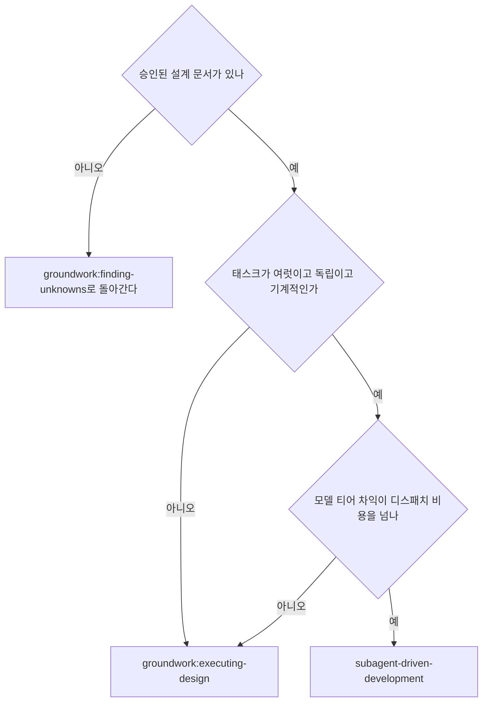

# subagent-driven-development

승인된 설계 문서를 태스크로 쪼갠 뒤 태스크마다 fresh 구현자 서브에이전트를 띄우고, 태스크마다 리뷰를 붙이고, 마지막에 브랜치 전체를 보는 최종 리뷰를 한 번 한다.

## Execution contract

**입력**: 실행할 설계 문서 파일의 경로 하나를 호출자에게 받는다.  
`groundwork:finding-unknowns`(설계 문서를 쓰고 승인까지 받는 설계 진입 스킬) 또는 `groundwork:executing-design`(설계 실행의 기본 경로)이 그 경로를 넘긴다.  
경로를 받지 못했으면 어느 설계 문서를 실행할지 사용자에게 묻는다.  
임의로 찾아 고르지 않는다.  
아래 본문에서 `DESIGN_FILE`은 그 경로를 가리키는 이름이고 셸 변수가 아니다.  
셸 커맨드에 넣을 때는 그 자리에 실제 경로를 적는다.

**주체**: 이 스킬을 실행하는 너를 `컨트롤러`라 부른다.  
`구현자`와 `리뷰어`는 컨트롤러가 디스패치하는 서브에이전트다.  
`사용자`는 설계 문서를 승인한 사람이다.  
컨트롤러는 조율만 하고 코드를 직접 고치지 않는다.

**경로 기준**: 이 문서의 상대 경로는 이 스킬 디렉터리 기준이다.
다만 실행 자산은 이 디렉터리에 없다.  
스크립트와 태스크 리뷰어·재리뷰 프롬프트는 기본 경로인 `groundwork:executing-design`이 소유하므로 아래에서 `scripts/X`라고 적은 것은 `groundwork:executing-design`의 `scripts/X`이고, 마크다운 링크의 `../executing-design/`이 그 디렉터리다.  
이 스킬이 소유하는 것은 구현자 프롬프트 하나다.  
워크트리와 실행 스크래치, 코드 산출물의 경로는 대상 repo 루트 기준이다(두 디렉터리의 정의는 아래 「Setup」).

**출력**: 전 태스크를 마치면 무엇을 구현했고 어느 검증이 통과했는지 사용자에게 보고하고 `groundwork:finish`(머지·PR·보관을 정하고 설계 문서의 갱신일을 올리는 스킬)로 넘긴다.  
중간에 끝나면 어디까지 했고 무엇에 막혔는지를 같은 형식으로 보고한다.

**`groundwork:finish`에 넘기는 것은 둘이다.**  
`DESIGN_FILE` 경로와 실행 스크래치 경로다.  
그 스킬이 앞엣것의 갱신일을 올리고 뒤엣것의 진행 기록으로 보류된 발견을 사용자에게 낸다.  
둘 다 넘기지 않으면 그 스킬이 사용자에게 되묻고 「연속 실행」이 없앤 확인 질문이 마지막에 되살아난다.

**서술 최소화**: 도구 호출 사이에 한 줄 넘게 늘어놓지 않는다.  
진행 기록과 도구 결과가 기록을 담는다.

**연속 실행**: 태스크 사이에 사용자에게 확인하려 멈추지 않는다.  
멈추는 이유는 3가지뿐이다.  
해소할 수 없는 막힘, 진행을 정말로 막는 모호함, 전 태스크 완료.  
"계속할까요?" 같은 확인과 진행 요약은 사용자의 시간을 버린다.

## Applicability

**이 스킬은 기본 경로가 아니다.**  
설계 실행의 기본은 `groundwork:executing-design`이고, 거기서는 실행자가 직접 구현하고 리뷰만 격리한다.

구현에서 격리는 비용이기 때문이다.  
컨트롤러는 설계 문서와 앞 태스크의 결정을 이미 알고 있고, 그것을 버린 뒤 디스패치 프롬프트로 부분 복원하면 버린 것보다 적게 복원된다.  
그 복원 비용을 상쇄하는 이득이 있을 때만 이 스킬을 쓴다.

아래 셋을 **전부** 만족할 때만 이 경로를 택한다.

- 태스크가 여럿이고 서로 독립이다
- 태스크가 기계적이라 더 약한 모델로 내려도 된다
- 모델 티어 차익이 디스패치 오버헤드를 넘는다

셋 중 하나라도 어긋나면 `groundwork:executing-design`으로 돌아간다.  
판단이 서지 않으면 그쪽을 쓴다.

서브에이전트를 띄울 수 없는 실행 환경에서도 `groundwork:executing-design`을 쓴다.  
다만 그 스킬도 리뷰어는 서브에이전트로 띄우므로, 서브에이전트가 아예 없으면 리뷰 게이트를 벤더 교차 디스패치로 대체한다([choosing-model-tier.md](../using-groundwork/choosing-model-tier.md)의 「Cross-vendor dispatch」).

## Setup

**두 종류의 디렉터리를 이름을 갈라 쓴다.**  
같은 말로 부르면 아래 「Handoff」의 지시가 어느 쪽을 겨누는지 갈리지 않고, 커밋된 코드가 든 워크트리를 지우는 사고가 난다.

- **워크트리**: `groundwork:using-git-worktrees`(격리 워크스페이스를 확보하는 스킬)가 만든 git worktree.  
  브랜치의 작업 트리이고 커밋된 코드가 여기 산다.  
  이 스킬은 워크트리를 만들거나 확인만 하고 **지우지 않는다**.
- **실행 스크래치**: 아래 `scripts/design-scratch`가 만든 `<repo-root>/.groundwork/run/<설계 문서 파일명에서 확장자를 뺀 값>/`.  
  워크트리 **안에** 있고 커밋되지 않는다.  
  이 문서에서 `<scratch>`는 그 경로를 가리킨다.

작업이 워크트리에서 일어나게 한다.  
`groundwork:using-git-worktrees`로 만들거나 기존 것을 확인한다.  
사용자의 명시 동의 없이 main·master 브랜치에서 구현을 시작하지 않는다.

대화 기억은 컨텍스트 압축을 견디지 못한다.  
컨텍스트 압축은 대화가 길어질 때 실행 환경이 앞선 대화를 요약으로 대체하는 동작이고, 그때 세부는 사라진다.  
실제 세션에서 자기 위치를 잃은 컨트롤러가 완료된 태스크 묶음을 통째로 다시 디스패치한 사례가 있다.  
이것이 관측된 가장 비싼 실패다.  
진행을 todo가 아니라 **진행 기록 파일**에 기록한다.

- 설계 문서마다 실행 스크래치 하나다.  
  `scripts/design-scratch DESIGN_FILE`을 돌리면 그 디렉터리를 만들고 절대 경로를 stdout으로 출력한다.  
  이 설계 문서의 모든 단명 산출물(진행 기록·브리프·리포트·리뷰 패키지)이 거기 모인다.  
  다른 설계 문서의 디렉터리는 읽지도 쓰지도 않는다.
- `<scratch>/progress.md`에 이 설계 문서의 진행 기록이 있는지 확인한다.  
  첫 줄이 네 설계 문서 파일을 가리키면 `태스크 <N>: 완료` 줄이 있는 태스크는 끝난 것이다.  
  다시 디스패치하지 않고 그 줄이 없는 첫 태스크에서 재개한다.  
  마지막 줄이 fix 라운드인 태스크는 루프 중간이므로 다음 라운드에서 재개한다.  
  첫 줄이 다른 설계 문서를 가리키는 진행 기록은 남의 진행이다.  
  그대로 두고 자기 것을 새로 연다.
- 진행 기록을 만들 때 첫 줄에 정체를 적는다: `# SDD 진행 기록 — 설계: <설계 문서 파일 경로>`.  
  아래 「Breakdown」에서 확정한 태스크 목록을 그 다음에 적는다.  
  분해는 커밋되는 문서로 남지 않으므로 진행 기록에 적지 않으면 재개 지점이 사라진다.
- 진행 기록은 복구할 때 읽는 지도다.  
  진행 기록이 지목한 커밋은 네 컨텍스트가 그것을 만든 기억을 잃어도 git에 실재한다.  
  압축 이후에는 자기 기억보다 진행 기록과 `git log`를 믿는다.
- `git clean -fdx`(git이 추적하지 않는 파일을 무시 목록까지 포함해 지우는 커맨드)는 실행 스크래치를 파괴한다.  
  진행 기록 파일은 그렇게 지워지면 되살릴 수 없다.  
  `git log`의 커밋 메시지로 어느 태스크까지 끝났는지 재구성해 진행 기록을 다시 연다.

## Breakdown

설계 문서는 실행 단계에 계약으로 작동한다.  
무엇을 만들고 무엇이 되면 끝인지를 정하되 어떤 순서로 어느 파일을 건드릴지는 정하지 않는다.  
분해는 컨트롤러가 착수 시점에 한다.

분해의 규범은 `groundwork:executing-design`의 「Break the work into tasks」가 정본이다.  
파일 구조를 먼저 그리고, 태스크 경계를 빌드·테스트 통과 지점에 두고, 태스크마다 건드리는 파일·인터페이스·검증 커맨드·선행 태스크를 확정하고, 「Signs the breakdown is unfinished」에 걸리는 것을 착수 전에 없앤다.  
그 절을 읽고 같은 기준으로 분해한다.

이 스킬에는 조건이 하나 더 붙는다.  
**구현자는 자기 태스크만 본다.**  
fresh 서브에이전트는 세션 히스토리를 상속받지 않으므로 이웃 태스크에만 적힌 것은 도달하지 않는다.  
그래서 태스크마다 다음이 그 안에 완결돼 있어야 한다.

- 어느 파일을 건드리는가
- 무엇을 쓰는가. 앞 태스크에서 쓰는 것과 뒤 태스크가 의존하는 것을 정확한 함수명·파라미터·반환 타입으로
- 어떻게 검증하는가
- 좋은 테스트 설계를 구현자 판단에 맡기지 않고 무엇을 어떻게 검증할지 분해가 정한다

분해를 마치면 태스크마다 todo를 만들고 진행 기록에 태스크 목록을 적는다.

착수 전에 태스크 제목과 각 태스크가 끝나면 무엇이 동작하는지를 대화에 한 줄씩 짚는다.  
이것은 게이트가 아니라 통지다.  
답을 기다리지 않고 곧바로 착수하고, 사용자가 빠진 것을 짚으면 그 자리에서 분해를 고친다.

태스크 1을 디스패치하기 전에 설계 문서를 한 번 훑어 충돌을 찾는다.

- 서로 모순되거나 설계 문서의 「Global constraints」과 모순되는 요구
- 설계 문서가 명시로 요구하는데 리뷰 기준이 결함으로 보는 것(아무것도 단언하지 않는 테스트, 로직 블록을 그대로 복제한 것)

찾은 것을 **한 번에 묶어** 사용자에게 묻는다.  
발견마다 그것을 요구하는 설계 문서의 텍스트를 나란히 두고 어느 쪽이 우선인지 묻는다.  
실행 시작 전에 한 번이고 진행 중 발견마다 끼어드는 것이 아니다.  
훑어서 깨끗하면 아무 말 없이 진행한다.  
구현에서만 드러나는 충돌은 리뷰 루프가 걸러낸다.

구현 중 설계 문서에 없던 판단이 나오면 보수적으로 택해 진행하고 기록한다.  
뒤에 오는 태스크가 그 판단에 기대게 되면 설계 문서 「Design」에 그 결정을 더한다.  
개정 절차는 `groundwork:executing-design`의 「Revise the design document」이 정본이다.  
코드가 스스로 설명하는 세부는 코드 주석으로 둔다.  
결정만 모으는 별도 문서를 새로 만들지 않는다.  
모호함이나 설계 문서의 공백을 임의로 해석하지 않는다.  
설계 문서로 회귀해 재리뷰한다.  
사용자 의도 없이 정할 수 없는 결정만 사용자에게 올린다.  
설계 문서에 없는 작업은 범위 변경이므로 사용자에게 확인한다.  
설계 문서가 요구한 것이 구현에서 성립하지 않는 것으로 드러나면 설계 문서를 고친다.  
어느 절이 바뀌느냐에 따라 재승인인지 재리뷰인지가 갈리고 그 판정은 `groundwork:executing-design`의 「Revise the design document」이 정본이다.

## Model selection

역할마다 감당 가능한 가장 약한 모델을 써서 비용을 아끼고 속도를 올린다.  
티어 정의와 역할별 배정은 [choosing-model-tier.md](../using-groundwork/choosing-model-tier.md)에 있다.  
첫 구현자를 디스패치하기 전에 읽는다.

**서브에이전트를 디스패치할 때 모델을 항상 명시한다.**  
모델을 빠뜨리면 세션 모델을 상속하고 그것은 대개 가장 유능하고 가장 비싼 모델이라 이 규율이 무력해진다.  
모델 티어 차익이 이 스킬을 고른 이유이므로 명시를 빠뜨리면 이 경로를 고른 근거 자체가 사라진다.

## Task loop

디스패치 프롬프트에 붙여넣는 것과 서브에이전트가 출력하는 것은 남은 세션 내내 네 컨텍스트에 상주하고 이후 모든 턴에서 다시 읽힌다.  
산출물은 파일로 넘긴다.

### Dispatch the implementer

디스패치 전에 이 태스크의 시작 커밋을 기록한다(`git rev-parse HEAD`).  
아래에서 `BASE`는 그 값이고 리뷰 패키지와 fix 라운드 diff가 이 값을 쓴다.

- **태스크 브리프**: 분해에서 확정한 이 태스크의 내용을 실행 스크래치에 파일로 쓴다(`<scratch>/task-<N>-brief.md`).  
  브리프가 요구의 단일 출처로 남게 디스패치를 구성한다.  
  브리프는 분해의 산물이므로 컨트롤러가 직접 쓴다.  
  설계 문서에서 이 태스크를 구속하는 전역 제약은 정확한 값 그대로 브리프에 복사한다.  
  요약하면 값을 잃고 잃은 값은 구현자에게 도달하지 않는다.
- **디스패치에 담을 것**: (1) 이 태스크가 프로젝트 어디에 놓이는지 한 줄, (2) 브리프 경로를 "이것부터 읽어라. 네 요구이고 정확한 값이 그대로 들어 있다"로 소개, (3) 브리프가 알 수 없는 앞 태스크의 인터페이스·결정, (4) 브리프에서 발견한 모호함에 대한 네 해소, (5) 리포트 파일 경로와 리포트 계약.  
  정확한 값(숫자·문자열·시그니처·테스트 케이스)은 브리프에만 둔다.
- **리포트 파일**: 구현자의 리포트 파일 이름을 브리프에서 딴다(브리프 `…/task-N-brief.md` → 리포트 `…/task-N-report.md`).  
  디스패치 프롬프트에 그 경로를 넣는다.  
  구현자는 전체 리포트를 거기 쓰고 상태·커밋·테스트 한 줄 요약·우려만 반환한다.
- 디스패치 프롬프트는 태스크 하나를 서술하지 세션 히스토리를 서술하지 않는다.  
  누적된 앞 태스크 요약("태스크 1~3 이후 상태")을 뒤 디스패치에 붙여넣지 않는다.  
  실제 세션에서 디스패치 프롬프트가 42k자에 이르렀고 그중 99%가 붙여넣은 히스토리였다.  
  fresh 서브에이전트에 필요한 것은 자기 태스크, 자기가 건드리는 인터페이스, 전역 제약뿐이다.
- 설계 문서 파일 전체를 서브에이전트에 읽히지 않는다.
- 앞 태스크가 이 태스크가 건드리는 영역에 발견을 보류해 뒀으면 그 진행 기록 항목을 가리키는 포인터를 디스패치에 담는다.
- 디스패치 결과에서 구현자의 에이전트 식별자를 기록한다.  
  fix 루프 1~3라운드가 이 에이전트를 재개한다.
- **구현 서브에이전트를 병렬로 띄우지 않는다**(충돌한다).

템플릿: [implementer-prompt.md](implementer-prompt.md)

### Process the report

구현자는 4가지 상태 중 하나로 보고한다.

**DONE**: 리뷰 패키지를 만들고 그 경로로 태스크 리뷰어를 디스패치한다.  
패키지는 `scripts/review-package DESIGN_FILE BASE HEAD`를 돌리고 출력된 경로를 쓴다.  
`BASE`는 구현자 디스패치 전에 기록한 커밋이다.  
`HEAD~1`은 커밋이 여럿인 태스크에서 마지막 하나만 남기고 조용히 버리므로 절대 쓰지 않는다.

**DONE_WITH_CONCERNS**: 작업은 끝냈으나 의심을 표시한 상태다.  
진행 전에 우려를 읽는다.  
정확성·범위에 관한 우려면 리뷰 전에 해소한다.  
관찰이면(예: "이 파일이 커지고 있다") 기록하고 리뷰로 넘어간다.

**NEEDS_CONTEXT**: 제공되지 않은 정보가 필요하다.  
빠진 컨텍스트를 주고 다시 디스패치한다.

**BLOCKED**: 태스크를 끝낼 수 없다.  
막힘을 판정한다.  
컨텍스트 문제면 컨텍스트를 더 주고 같은 모델로 재디스패치한다.  
추론이 더 필요하면 더 유능한 모델로 재디스패치한다.  
태스크가 너무 크면 더 작게 쪼갠다.  
분해나 설계 문서 자체가 틀렸으면 사용자에게 올린다.

에스컬레이션을 **무시하거나** 아무것도 바꾸지 않은 채 같은 모델에 재시도시키지 않는다.  
구현자가 막혔다고 했으면 무언가가 바뀌어야 한다.

구현자가 질문하면(시작 전이든 도중이든) 명확하고 완전하게 답하고 필요하면 컨텍스트를 더 주고 구현으로 재촉하지 않는다.

### Review the task

태스크 리뷰는 태스크 범위의 게이트다.  
브랜치 전체를 보는 판정은 아래 「Final review」에서 한 번 일어난다.  
태스크 리뷰를 건너뛰지 않고 두 판정(설계 준수와 태스크 품질) 중 하나가 빠진 리포트를 받지 않는다.  
구현자의 self-review는 태스크 리뷰를 대체하지 않는다.  
둘 다 필요하다.

- 리뷰어에게 diff를 파일로 넘긴다.  
  `scripts/review-package DESIGN_FILE BASE HEAD`를 돌리고 출력된 경로를 넘긴다.  
  그 출력은 네 컨텍스트에 들어오지 않고 리뷰어는 커밋 목록·변경 파일 요약·문맥 포함 전체 diff를 한 번의 Read로 본다.  
  구현자 디스패치 전에 기록한 `BASE`를 쓴다.  
  diff 파일 없이 태스크 리뷰어를 디스패치하지 않는다.
- **리뷰어 입력**: 브리프 파일, 리포트 파일, 리뷰 패키지 경로 3개에 이 태스크를 구속하는 전역 제약을 더한다.
- 리뷰어에게 넘기는 전역 제약 블록이 그 리뷰어의 주의 렌즈다.  
  설계 문서의 「Global constraints」과 「Acceptance criteria」에서 구속력 있는 요구를 그대로 복사한다.  
  정확한 값, 정확한 형식, 컴포넌트 사이의 관계 진술("X와 같은 레이아웃", "Y와 일치")을 담는다.  
  프로세스 규칙(불필요한 기능 배격·테스트 위생·리뷰 방법)은 리뷰어 템플릿이 이미 담고 있다.  
  제약 블록은 이 프로젝트의 설계 문서가 요구하는 것을 담는 곳이다.
- 구체적이고 태스크에 국한된 이유 없이 "모든 사용처를 확인하라", "필요하면 레이스 테스트를 돌려라" 같은 열린 지시를 더하지 않는다.
- 구현자가 같은 코드에서 이미 돌린 테스트를 리뷰어에게 다시 돌리라고 하지 않는다.  
  구현자 리포트가 테스트 증거를 담는다.
- **리뷰어를 위해 발견을 미리 판정하지 않는다.**  
  특정 이슈를 무시하거나 표시하지 말라고 지시하지 않는다.  
  오탐이라고 생각하면 리뷰어가 제기하게 두고 리뷰 루프에서 판정한다.  
  네가 쓰는 프롬프트에 "표시하지 마라", "X를 결함으로 보지 마라", "최대 Minor로", "설계 문서가 그렇게 정했다"가 들어 있으면 멈춘다.  
  리뷰 루프를 아끼려고 미리 판정하는 중이다.

태스크 리뷰어는 "diff만으로 검증 불가" 항목을 보고할 수 있다.  
바뀌지 않은 코드에 있거나 태스크를 가로지르는 요구다.  
이것들이 나머지 리뷰를 막지는 않지만 태스크를 완료로 표시하기 전에 네가 직접 해소해야 한다.  
리뷰어에게 없는 설계 문서와 태스크 간 컨텍스트를 네가 안다.  
실제 공백으로 확인되면 설계 준수 실패로 취급해 다른 발견들과 함께 fix 루프에 넣는다.

템플릿: [task-reviewer-prompt.md](../executing-design/task-reviewer-prompt.md)

### Fix loop

리뷰가 설계 불합격을 내거나 Critical·Important 발견이 있거나 네가 실제 공백으로 확인한 "검증 불가" 항목이 있으면 루프가 돈다.  
`Critical`·`Important`·`Minor`는 리뷰어 템플릿이 정한 심각도 등급이고 정의는 그 템플릿에 있다.

루프가 시작되기 전에 두 경로가 즉시 빠져나간다.

- Minor 발견은 진행하며 진행 기록에 기록한다(`태스크 <N>: minor(보류): <한 줄>`).  
  최종 리뷰가 그 목록을 보고 머지 전에 무엇을 고쳐야 할지 분류하게 가리킨다.  
  최종 리뷰가 이 목록을 읽지 않으면 보류 Minor는 조용히 폐기된다.  
  Minor는 루프에 들어가지 않는다.
- 태스크 리뷰어가 리포트에 `design-mandated`(설계 문서가 그렇게 하라고 요구했다)로 표시한 발견, 그리고 설계 문서의 텍스트가 요구하는 것과 충돌하는 발견은 사용자의 결정이다.  
  발견과 설계 문서의 텍스트를 제시하고 어느 쪽이 우선인지 묻는다.  
  설계 문서가 요구한다는 이유로 발견을 기각하지 않고 묻지 않은 채 설계 문서에 반하는 수정을 디스패치하지 않는다.

나머지는 루프에 들어간다.  
한 라운드는 수정 디스패치 하나 + 범위 한정 재리뷰 하나다.  
태스크당 최대 5라운드다.

**1~3라운드. 원래 구현자를 재개한다.**  
열린 발견을 그대로 보낸다.  
그 컨텍스트는 온전하다.  
태스크와 코드와 자기 선택을 안다.  
실행 환경이 살아 있는 서브에이전트에 메시지를 더 보낼 수 없으면 브리프 경로·리포트 파일 경로·발견을 들려 fresh 구현자를 디스패치한다.  
어느 쪽이든 리포트 파일이 지속 기억이다.

**4~5라운드. 더 유능한 모델로 fresh 구현자를 디스패치한다**(위 「Model selection」).  
브리프 경로, 리포트 파일 경로, 열린 발견, 그리고 이 틀을 준다: "앞선 구현자가 이 태스크를 [N]번 시도했다. 이제 네 것이다. 무엇을 시도했는지 리포트 파일을 읽어라."  
재개를 3번 견딘 루프는 대개 구현자가 자기 문제를 보지 못한다는 뜻이다.  
새로운 눈과 능력 상승을 한 번에 준다.

**매 라운드 공통**: 구현자가 고친다.  
그다음 수정한 코드를 덮는 테스트를 다시 돌리고 같은 리포트 파일에 수정 리포트를 덧붙인 뒤 최초 리포트와 같은 항목(상태·커밋·테스트 한 줄 요약·우려)을 반환한다.  
리뷰어를 재디스패치하기 전에 수정 리포트가 덮는 테스트·돌린 커맨드·출력 3가지를 담았는지 확인한다.  
3가지가 다 있을 때 재리뷰를 디스패치한다.  
수정 메시지에 덮는 테스트 파일을 지명한다.  
한 줄 수정에 전체 스위트가 필요하지 않다.

**재리뷰는 범위가 한정된다.**  
`scripts/review-package DESIGN_FILE FIX_BASE HEAD`를 돌린다.  
`FIX_BASE`는 직전 리뷰가 본 마지막 커밋이다.  
[re-review-prompt.md](../executing-design/re-review-prompt.md)에 발견 목록·브리프·리포트 파일·출력된 diff 경로를 실어 디스패치한다.  
재리뷰어는 발견마다 해소됐는지 판정하고 수정 diff 안의 새 파손만 표시한다.  
수정 diff의 새 Critical·Important 파손은 열린 발견 목록에 합류한다.  
범위 밖 관찰은 보류 minor로 진행 기록에 간다.  
루프를 연장하지 않는다.

**라운드마다** 진행 기록에 덧붙인다: `태스크 <N>: fix 라운드 <R>/5 (<X>개 해소, <Y>개 열림 — <발견 한 줄들>. 커밋 <base7>..<head7>)`

컨트롤러 세션에서 발견을 **직접 고치지 않는다**.  
네 컨텍스트는 조율용으로 깨끗하게 유지하고 컨트롤러가 고친 것은 리뷰를 건너뛴다.

**차단기**. 5라운드 재리뷰에도 발견이 열린 채면 디스패치를 멈춘다.  
열린 발견을 네가 직접 판정한다.  
리뷰어에게 없는 설계 문서와 태스크 간 컨텍스트를 네가 안다.

- **리뷰어가 틀렸거나 논쟁의 여지가 있다**: 보류한다.  
  `태스크 <N>: 보류 — <발견> — 판정: <왜 코드가 유지되는가>`.  
  최종 리뷰가 양쪽을 본다.
- **실제 문제지만 뒤 작업이 그 위에 쌓이지 않는다**: 같은 방식으로 보류하되 실제이고 이월했다는 판정을 적는다.
- **실제이고 뒤 작업이 그 위에 쌓인다**(설계 결함을 드러내는 경우도 여기다): 멈춘다.  
  `태스크 <N>: 막힘 — <이유>`를 덧붙이고 발견·충돌하는 설계 문서의 텍스트·수정 이력과 함께 사용자에게 보고한다.  
  구조적 실패를 보류하면 모든 의존 태스크가 그 위에 쌓이고 최종 리뷰도 고칠 수 없는 문제를 떠안는다.

판정은 5라운드 상한에서만 한다.  
루프를 끝내려고 일찍 판정하는 것은 이름만 다른 미리 판정이다.  
모든 판정은 진행 기록 항목이다.  
조용한 폐기는 금지다.

### Complete the task

리뷰가 깨끗하게 돌아오거나 상한에서 열린 발견이 전부 판정과 함께 보류되면 완료 줄을 진행 기록에 덧붙인다.

- `태스크 <N>: 완료 (커밋 <base7>..<head7>, 리뷰 깨끗)`
- 차단기가 걸린 뒤라면 `태스크 <N>: 완료 (커밋 <base7>..<head7>, <K>개 보류)`

그다음 todo를 완료로 표시하고 넘어간다.  
리뷰에 열린 Critical·Important가 있는데 고쳐지지도 상한에서 판정과 함께 보류되지도 않았다면 다음 태스크로 가지 않는다.

## Final review

최종 리뷰도 패키지를 받는다.  
`scripts/review-package DESIGN_FILE MERGE_BASE HEAD`를 돌리고 출력된 경로를 최종 리뷰 디스패치에 넣는다.  
`MERGE_BASE`는 이 브랜치가 갈라져 나온 커밋이고 `git merge-base main HEAD`로 구한다(기본 브랜치 이름이 다르면 그 이름을 쓴다).  
최종 리뷰어가 git 커맨드로 브랜치 diff를 다시 만들지 않고 파일 하나를 읽는다.

가장 유능한 모델로 디스패치하고(위 「Model selection」) `groundwork:requesting-code-review`의 [code-reviewer-prompt.md](../requesting-code-review/code-reviewer-prompt.md)를 쓴다.  
진행 기록의 보류 minor와 보류 항목 줄을 가리켜 머지 전에 무엇을 고쳐야 할지 분류하게 한다.

최종 리뷰가 발견을 내면 **수정 서브에이전트 하나**에 발견 목록 전체를 준다.  
발견마다 수정자를 붙이지 않는다.  
발견별 수정자는 각자 컨텍스트를 다시 쌓고 스위트를 다시 돌린다.  
실제 세션에서 최종 리뷰 수정 묶음이 그 설계 문서의 전 태스크를 합친 것보다 비쌌다.  
그다음 수정 묶음의 범위 한정 재리뷰를 정확히 한 번 돌린다(`scripts/review-package DESIGN_FILE FIX_BASE HEAD`와 [re-review-prompt.md](../executing-design/re-review-prompt.md)).

남은 발견은 태스크 루프의 차단기와 같이 판정한다.  
판정과 함께 보류하거나 뒤 작업이 그 위에 쌓이는 것에서 멈춘다.  
두 번째 수정 묶음은 없다.  
남은 그 발견은 `groundwork:finish`가 선택지를 제시할 때 사용자에게 올라간다.

받은 리뷰 피드백을 검증하고 대응하는 규율은 `groundwork:receiving-code-review`가 정본이다.

## Handoff

**이 스킬은 아무것도 지우지 않는다.**  
워크트리도 실행 스크래치도 그대로 둔 채 `groundwork:finish`로 넘긴다.  
그 스킬이 테스트를 확인하고, 진행 기록에서 보류된 발견을 사용자에게 내고, 설계 문서의 갱신일을 올리고, 선택지를 제시하고 선택을 실행한 뒤에 정리한다.

여기서 지우면 그 뒤가 전부 무너진다.  
진행 기록이 사라지면 위 「Fix loop」의 차단기와 「Final review」가 남긴 보류 판정·막힘 사유가 사용자에게 도달할 경로가 없다.  
컨트롤러가 리뷰어의 반대를 무릅쓰고 내린 판정이 조용히 폐기되는 것이라 「Common rationalizations」의 조용한 폐기 금지와 같은 사안이다.

넘길 때 `DESIGN_FILE` 경로와 실행 스크래치 경로를 함께 준다(위 「Execution contract」의 출력).

## Common rationalizations

| 변명                                           | 실제                                                                                                                                                             |
|------------------------------------------------|------------------------------------------------------------------------------------------------------------------------------------------------------------------|
| "서브에이전트가 기본이니 일단 이걸로"          | 기본은 `groundwork:executing-design`이다. 「Applicability」의 세 조건을 전부 만족할 때만 이 경로다.                                                              |
| "설계 준수는 이 정도면 충분하다"               | 리뷰어가 설계 문서의 공백을 찾았으면 안 끝난 것이다. 고치거나 상한에 도달해 판정한다. 출구는 그 둘뿐이다.                                                        |
| "내가 고치는 게 빠르다, 디스패치는 오버헤드다" | 컨트롤러가 고치면 네 컨텍스트가 오염되고 리뷰를 건너뛴다. 구현자를 재개한다.                                                                                     |
| "한 라운드만 더 하면 수렴한다"                 | 상한을 넘으면 라운드는 수렴하지 않는다. 실패가 구조적이다. 판정하고 경로를 정한다.                                                                               |
| "리뷰어가 어차피 새로운 걸 또 찾을 것이다"     | 범위 한정 재리뷰는 수정을 검증할 뿐 배회하지 않는다. 손대지 않은 코드의 새 발견은 루프가 아니라 진행 기록으로 간다.                                              |
| "이 발견은 명백히 틀렸으니 버리겠다"           | 판정은 상한에서만 하고 모든 판정은 진행 기록 항목이다. 조용한 폐기는 금지다.                                                                                     |
| "수정이 작았으니 재리뷰는 건너뛴다"            | 리뷰 안 된 수정으로 회귀가 들어온다. 모든 라운드는 범위 한정 재리뷰로 끝난다.                                                                                    |
| "리뷰가 루프를 느리게 한다"                    | 리뷰 없는 루프는 검증 없이 헛도는 것이다. 리뷰가 이 루프를 멈추고 방향을 잡는다.                                                                                 |
| "진행 기록을 남기는 건 오버헤드다"             | 진행 기록이 압축을 견디는 유일한 것이다. 진행 기록 없는 컨트롤러가 완료된 태스크 묶음을 통째로 다시 디스패치했다.                                                |
| "모델을 명시 안 해도 알아서 되겠지"            | 세션 모델을 상속하면 티어 차익이 사라지고, 그 차익이 이 경로를 고른 유일한 근거다.                                                                               |
| "끝났으니 스크래치를 치우고 넘긴다"            | 진행 기록이 `groundwork:finish`의 「Report the outstanding findings」 입력이다. 지우면 차단기가 내린 판정이 사용자에게 도달하지 않는다. 정리는 그 스킬의 몫이다. |
| "워크스페이스를 지우라고 적혀 있었다"          | 이 스킬은 워크트리도 실행 스크래치도 지우지 않는다. 둘의 정의는 「Setup」에 있고 종료 처리는 `groundwork:finish`가 한다.                                         |
| "`finish`가 알아서 설계 문서를 찾을 것이다"    | 경로를 넘기지 않으면 그 스킬이 사용자에게 되묻는다. 「연속 실행」이 없앤 확인 질문이 마지막에 되살아난다.                                                        |
