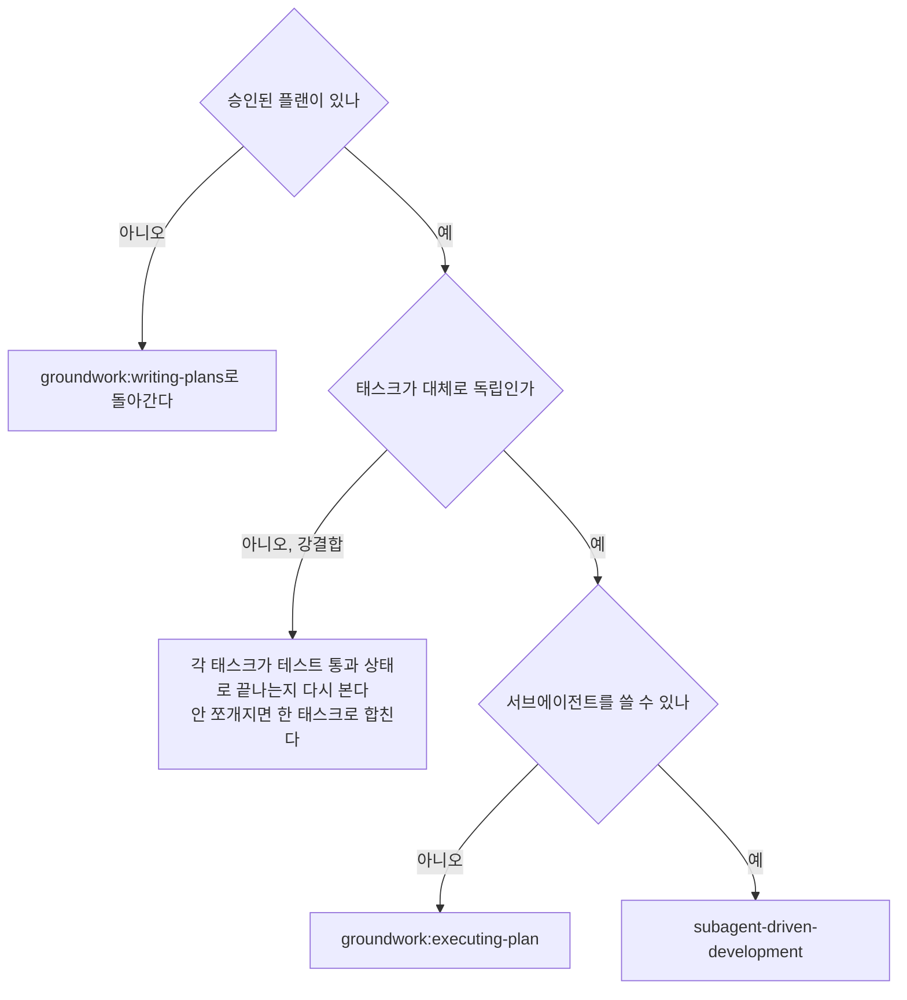

# subagent-driven-development

플랜을 실행한다.
태스크마다 fresh 구현자 서브에이전트를 띄우고 태스크마다 리뷰(스펙 준수 + 코드 품질)를 붙이고 마지막에 브랜치 전체를 보는 최종 리뷰를 한 번 한다.

**왜 서브에이전트인가**: 컨텍스트가 격리된 전문 에이전트에 태스크를 위임한다.
지시와 컨텍스트를 정밀하게 구성해 서브에이전트가 초점을 잃지 않게 한다.
서브에이전트는 세션 컨텍스트나 히스토리를 상속받지 않는다.
필요한 것만 구성해 준다.
이렇게 하면 조율에 쓸 자기 컨텍스트도 지킨다.

**핵심 원칙**: 태스크마다 fresh 서브에이전트 + 태스크 리뷰(스펙 + 품질) + 마지막 최종 리뷰.

**주체**: 이 스킬을 실행하는 너를 컨트롤러라 부른다.
구현자·리뷰어는 네가 디스패치하는 서브에이전트다.

**입력**: 실행할 플랜 파일의 경로를 호출자에게 받는다.
`groundwork:writing-plans`가 승인된 플랜을 넘길 때 그 경로를 준다.
경로를 받지 못했으면 어느 플랜을 실행할지 사용자에게 묻는다.
아래 `PLAN_FILE`은 그 경로다.

**서술 최소화**: 도구 호출 사이에 한 줄 넘게 늘어놓지 않는다.
진행 기록과 도구 결과가 기록을 담는다.

**연속 실행**: 태스크 사이에 사용자에게 확인하려 멈추지 않는다.
플랜의 전 태스크를 멈춤 없이 실행한다.
멈추는 이유는 3가지뿐이다.
해소할 수 없는 BLOCKED, 진행을 정말로 막는 모호함, 전 태스크 완료. "계속할까요?"
같은 확인과 진행 요약은 사용자의 시간을 버린다.
플랜을 실행하라고 했으니 실행한다.

## 적용 판단

이 스킬은 서브에이전트를 쓸 수 있는 에이전트 실행 환경에서 플랜 실행의 기본 경로다.
서브에이전트가 없거나 격리 이득이 없으면 `groundwork:executing-plan`을 쓴다.

## 셋업

작업이 격리된 워크스페이스에서 일어나게 한다.
`groundwork:using-git-worktrees`로 만들거나 기존 것을 확인한다.
사용자의 명시 동의 없이 main·master 브랜치에서 구현을 시작하지 않는다.

대화 기억은 컨텍스트 압축을 견디지 못한다.
실제 세션에서 자기 위치를 잃은 컨트롤러가 완료된 태스크 묶음을 통째로 다시 디스패치한 사례가 있다.
이것이 관측된 가장 비싼 실패다.
진행을 todo가 아니라 **진행 기록 파일**에 기록한다.

**경로 기준**: 이 문서가 적은 `scripts/...`는 모두 이 스킬 디렉터리 `${CLAUDE_PLUGIN_ROOT}/skills/subagent-driven-development/` 기준이고 `${CLAUDE_PLUGIN_ROOT}`는 groundwork 플러그인이 설치된 디렉터리이지 실행 시점 작업 디렉터리가 아니다.
워크스페이스와 산출물 경로는 대상 repo 루트 기준이다.

- 플랜마다 워크스페이스 하나다.
  스킬 시작 시 `scripts/sdd-workspace PLAN_FILE`을 돌리면 그 플랜의 git-ignore된 디렉터리(`<repo-root>/.groundwork/sdd/<plan-basename>/`)를 출력한다.
  이 플랜의 모든 산출물(진행 기록·브리프·리포트·리뷰 패키지)이 거기 모인다.
  다른 플랜의 디렉터리는 읽지도 쓰지도 않는다.
- `<workspace>/progress.md`에 이 플랜의 진행 기록이 있는지 확인한다.
  첫 줄이 네 플랜 파일을 가리키면 `태스크 <N>: 완료` 줄이 있는 태스크는 끝난 것이다.
  다시 디스패치하지 않고 그 줄이 없는 첫 태스크에서 재개한다.
  마지막 줄이 fix 라운드인 태스크는 루프 중간이므로 다음 라운드에서 재개한다.
  첫 줄이 다른 플랜을 가리키는 진행 기록은 남의 진행이다.
  그대로 두고 자기 것을 새로 연다.
- 진행 기록을 만들 때 첫 줄에 정체를 적는다: `# SDD 진행 기록 — 플랜: <플랜 파일 경로>`.
- 진행 기록은 복구할 때 읽는 지도다.
  진행 기록이 지목한 커밋은 네 컨텍스트가 그것을 만든 기억을 잃어도 git에 실재한다.
  압축 이후에는 자기 기억보다 진행 기록과 `git log`를 믿는다.
- `git clean -fdx`는 워크스페이스를 파괴한다(git-ignore된 스크래치다).
  진행 기록 파일은 그렇게 지워지면 되살릴 수 없다.
  `git log`의 커밋 메시지로 어느 태스크까지 끝났는지 재구성해 진행 기록을 다시 연다.

플랜을 한 번 읽고 컨텍스트와 Global Constraints를 파악한 뒤 태스크마다 todo를 만든다.

태스크의 성공 기준은 그 태스크의 실행 검증 커맨드다.
실행 환경에 검증 커맨드 통과를 강제하는 훅이 있으면 그것이 함께 막는다.
사용자가 직접 입력해야 하는 슬래시 커맨드는 서브에이전트에게 넘기는 지시에 쓰지 않는다.

구현 중 스펙·플랜에 없던 판단이 나오면 보수적으로 택해 진행하고 기록한다.
그 repo의 아키텍처 결정이면 ADR로 남긴다.
위치·번호·커밋·형식·신설 절차는 `groundwork:writing-adr`가 정본이고 그 절차를 그대로 따른다.
코드가 스스로 설명하는 세부는 코드 주석으로 둔다(노트 산출물은 없다).
모호함이나 스펙 공백을 임의로 해석하지 않는다.
스펙으로 회귀해 재리뷰한다.
사용자 의도 없이 정할 수 없는 결정만 사용자에게 올린다.
플랜에 없는 작업은 범위 변경이므로 사용자에게 확인한다.

태스크 1을 디스패치하기 전에 플랜을 한 번 훑어 충돌을 찾는다.

- 서로 모순되거나 플랜의 Global Constraints와 모순되는 태스크
- 플랜이 명시로 요구하는데 리뷰 기준이 결함으로 보는 것(아무것도 단언하지 않는 테스트, 로직 블록을 그대로 복제한 것)

찾은 것을 **한 번에 묶어** 사용자에게 묻는다.
발견마다 그것을 요구하는 플랜 텍스트를 나란히 두고 어느 쪽이 우선인지 묻는다.
실행 시작 전에 한 번이고 진행 중 발견마다 끼어드는 것이 아니다.
훑어서 깨끗하면 아무 말 없이 진행한다.
구현에서만 드러나는 충돌은 리뷰 루프가 걸러낸다.

## 모델 선택

역할마다 감당 가능한 가장 약한 모델을 써서 비용을 아끼고 속도를 올린다.
티어 정의와 역할별 배정은 [choosing-model-tier.md](choosing-model-tier.md)에 있다(이 SKILL.md가 놓인 디렉터리 기준).
첫 구현자를 디스패치하기 전에 읽는다.

**서브에이전트를 디스패치할 때 모델을 항상 명시한다.**
모델을 빠뜨리면 세션 모델을 상속하고 그것은 대개 가장 유능하고 가장 비싼 모델이라 이 규율이 무력해진다.

## 태스크 루프

디스패치 프롬프트에 붙여넣는 것과 서브에이전트가 출력하는 것은 남은 세션 내내 네 컨텍스트에 상주하고 이후 모든 턴에서 다시 읽힌다.
산출물은 파일로 넘긴다.

### 1. 구현자를 디스패치한다

디스패치 전에 BASE(`git rev-parse HEAD`)를 기록한다.
리뷰 패키지와 fix 라운드 diff가 이 값을 쓴다.

- **태스크 브리프**: 구현자를 디스패치하기 전에 `scripts/task-brief PLAN_FILE N`을 돌린다.
  태스크 전문을 고유 이름 파일로 뽑고 경로를 출력한다.
  브리프가 요구의 단일 출처로 남게 디스패치를 구성한다.
  디스패치에 담을 것은 이렇다.
  (1) 이 태스크가 프로젝트 어디에 놓이는지 한 줄, (2) 브리프 경로를 "이것부터 읽어라. 네 요구이고 정확한 값이 그대로 들어 있다"로 소개, (3) 브리프가 알 수 없는 앞 태스크의 인터페이스·결정, (4) 브리프에서 발견한 모호함에 대한 네 해소, (5) 리포트 파일 경로와 리포트 계약. 정확한 값(숫자·문자열·시그니처·테스트 케이스)은 브리프에만 둔다.
  서브에이전트에 플랜 파일 전체를 읽히지 않는다.
- **리포트 파일**: 구현자의 리포트 파일 이름을 브리프에서 딴다(브리프 `…/task-N-brief.md` → 리포트 `…/task-N-report.md`).
  디스패치 프롬프트에 그 경로를 넣는다.
  구현자는 전체 리포트를 거기 쓰고 상태·커밋·테스트 한 줄 요약·우려만 반환한다.
- 디스패치 프롬프트는 태스크 하나를 서술하지 세션 히스토리를 서술하지 않는다.
  누적된 앞 태스크 요약("태스크 1~3 이후 상태")을 뒤 디스패치에 붙여넣지 않는다.
  실제 세션에서 디스패치 프롬프트가 42k자에 이르렀고 그중 99%가 붙여넣은 히스토리였다.
  fresh 서브에이전트에 필요한 것은 자기 태스크, 자기가 건드리는 인터페이스, 전역 제약뿐이다.
- 앞 태스크가 이 태스크가 건드리는 영역에 발견을 보류해 뒀으면 그 진행 기록 항목을 가리키는 포인터를 디스패치에 담는다.
- 디스패치 결과에서 구현자의 에이전트 식별자를 기록한다.
  fix 루프 1~3라운드가 이 에이전트를 재개한다.
- **구현 서브에이전트를 병렬로 띄우지 않는다**(충돌한다).

템플릿: [implementer-prompt.md](implementer-prompt.md)

### 2. 리포트를 처리한다

구현자는 4가지 상태 중 하나로 보고한다.

**DONE**: 리뷰 패키지를 만들고(`scripts/review-package PLAN_FILE BASE HEAD`를 돌리고 출력된 경로를 쓴다.
BASE는 구현자 디스패치 전에 기록한 커밋이다.
`HEAD~1`은 커밋이 여럿인 태스크에서 마지막 하나만 남기고 조용히 버리므로 절대 쓰지 않는다) 그 경로로 태스크 리뷰어를 디스패치한다.

**DONE_WITH_CONCERNS**: 작업은 끝냈으나 의심을 표시한 상태다.
진행 전에 우려를 읽는다.
정확성·범위에 관한 우려면 리뷰 전에 해소한다.
관찰이면(예: "이 파일이 커지고 있다") 기록하고 리뷰로 넘어간다.

**NEEDS_CONTEXT**: 제공되지 않은 정보가 필요하다.
빠진 컨텍스트를 주고 다시 디스패치한다.

**BLOCKED**: 태스크를 끝낼 수 없다.
막힘을 판정한다.
컨텍스트 문제면 컨텍스트를 더 주고 같은 모델로 재디스패치한다.
추론이 더 필요하면 더 유능한 모델로 재디스패치한다.
태스크가 너무 크면 더 작게 쪼갠다.
플랜 자체가 틀렸으면 사용자에게 올린다.

에스컬레이션을 **무시하거나** 아무것도 바꾸지 않은 채 같은 모델에 재시도시키지 않는다.
구현자가 막혔다고 했으면 무언가가 바뀌어야 한다.

구현자가 질문하면(시작 전이든 도중이든) 명확하고 완전하게 답하고 필요하면 컨텍스트를 더 주고 구현으로 재촉하지 않는다.

### 3. 태스크를 리뷰한다

태스크 리뷰는 태스크 범위의 게이트다.
브랜치 전체를 보는 판정은 「최종 리뷰」에서 한 번 일어난다.
태스크 리뷰를 건너뛰지 않고 두 판정(스펙 준수와 태스크 품질) 중 하나가 빠진 리포트를 받지 않는다.
구현자의 self-review는 태스크 리뷰를 대체하지 않는다.
둘 다 필요하다.

- 리뷰어에게 diff를 파일로 넘긴다.
  `scripts/review-package PLAN_FILE BASE HEAD`를 돌리고 출력된 경로를 넘긴다.
  그 출력은 네 컨텍스트에 들어오지 않고 리뷰어는 커밋 목록·stat 요약·문맥 포함 전체 diff를 한 번의 Read로 본다.
  구현자 디스패치 전에 기록한 BASE를 쓴다.
  diff 파일 없이 태스크 리뷰어를 디스패치하지 않는다.
- **리뷰어 입력**: 브리프 파일, 리포트 파일, 리뷰 패키지 경로 3개에 이 태스크를 구속하는 전역 제약을 더한다.
- 리뷰어에게 넘기는 전역 제약 블록이 그 리뷰어의 주의 렌즈다.
  플랜의 Global Constraints나 스펙에서 구속력 있는 요구를 그대로 복사한다.
  정확한 값, 정확한 형식, 컴포넌트 사이의 관계 진술("X와 같은 레이아웃", "Y와 일치")을 담는다.
  프로세스 규칙(YAGNI·테스트 위생·리뷰 방법)은 리뷰어 템플릿이 이미 담고 있다.
  제약 블록은 이 프로젝트의 스펙이 요구하는 것을 담는 곳이다.
- 구체적이고 태스크에 국한된 이유 없이 "모든 사용처를 확인하라", "필요하면 레이스 테스트를 돌려라" 같은 열린 지시를 더하지 않는다.
- 구현자가 같은 코드에서 이미 돌린 테스트를 리뷰어에게 다시 돌리라고 하지 않는다.
  구현자 리포트가 테스트 증거를 담는다.
- **리뷰어를 위해 발견을 미리 판정하지 않는다.**
  특정 이슈를 무시하거나 표시하지 말라고 지시하지 않는다.
  오탐이라고 생각하면 리뷰어가 제기하게 두고 리뷰 루프에서 판정한다.
  네가 쓰는 프롬프트에 "표시하지 마라", "X를 결함으로 보지 마라", "최대 Minor로", "플랜이 그렇게 정했다"가 들어 있으면 멈춘다.
  리뷰 루프를 아끼려고 미리 판정하는 중이다.

태스크 리뷰어는 "diff만으로 검증 불가" 항목을 보고할 수 있다.
바뀌지 않은 코드에 있거나 태스크를 가로지르는 요구다.
이것들이 나머지 리뷰를 막지는 않지만 태스크를 완료로 표시하기 전에 네가 직접 해소해야 한다.
리뷰어에게 없는 플랜과 태스크 간 컨텍스트를 네가 안다.
실제 공백으로 확인되면 스펙 리뷰 실패로 취급해 다른 발견들과 함께 fix 루프에 넣는다.

템플릿: [task-reviewer-prompt.md](task-reviewer-prompt.md)

### 4. fix 루프

리뷰가 스펙 불합격을 내거나 Critical·Important 발견이 있거나 네가 실제 공백으로 확인한 "검증 불가" 항목이 있으면 루프가 돈다.

루프가 시작되기 전에 두 경로가 즉시 빠져나간다.

- Minor 발견은 진행하며 진행 기록에 기록한다(`태스크 <N>: minor(보류): <한 줄>`).
  최종 리뷰가 그 목록을 보고 머지 전에 무엇을 고쳐야 할지 분류하게 가리킨다.
  최종 리뷰가 이 목록을 읽지 않으면 보류 Minor는 조용히 폐기된다.
  Minor는 루프에 들어가지 않는다.
- 태스크 리뷰어가 리포트에 `plan-mandated`(플랜이 그렇게 하라고 요구했다)로 표시한 발견, 그리고 플랜 텍스트가 요구하는 것과 충돌하는 발견은 다른 플랜 모순과 마찬가지로 사용자의 결정이다.
  발견과 플랜 텍스트를 제시하고 어느 쪽이 우선인지 묻는다.
  플랜이 요구한다는 이유로 발견을 기각하지 않고 묻지 않은 채 플랜에 반하는 수정을 디스패치하지 않는다.

나머지는 루프에 들어간다.
한 라운드는 수정 디스패치 하나 + 범위 한정 재리뷰 하나다.
태스크당 최대 5라운드다.

**1~3라운드. 원래 구현자를 재개한다.**
열린 발견을 그대로 보낸다.
그 컨텍스트는 온전하다.
태스크와 코드와 자기 선택을 안다.
실행 환경이 살아 있는 서브에이전트에 메시지를 더 보낼 수 없으면 브리프 경로·리포트 파일 경로·발견을 들려 fresh 구현자를 디스패치한다.
어느 쪽이든 리포트 파일이 지속 기억이다.

**4~5라운드. 더 유능한 모델로 fresh 구현자를 디스패치한다**(모델 선택 절).
브리프 경로, 리포트 파일 경로, 열린 발견, 그리고 이 틀을 준다: "앞선 구현자가 이 태스크를 [N]번 시도했다. 이제 네 것이다. 무엇을 시도했는지 리포트 파일을 읽어라."
재개를 3번 견딘 루프는 대개 구현자가 자기 문제를 보지 못한다는 뜻이다.
새로운 눈과 능력 상승을 한 번에 준다.

**매 라운드 공통**: 구현자가 고친다.
그다음 수정한 코드를 덮는 테스트를 다시 돌리고 같은 리포트 파일에 수정 리포트를 덧붙인 뒤 최초 리포트와 같은 항목(상태·커밋·테스트 한 줄 요약·우려)을 반환한다.
리뷰어를 재디스패치하기 전에 수정 리포트가 덮는 테스트·돌린 커맨드·출력 3가지를 담았는지 확인한다.
3가지가 다 있을 때 재리뷰를 디스패치한다.
수정 메시지에 덮는 테스트 파일을 지명한다.
한 줄 수정에 전체 스위트가 필요하지 않다.

**재리뷰는 범위가 한정된다.**
`scripts/review-package PLAN_FILE FIX_BASE HEAD`를 돌린다.
FIX_BASE는 직전 리뷰가 본 head다.
[re-review-prompt.md](re-review-prompt.md)에 발견 목록·브리프·리포트 파일·출력된 diff 경로를 실어 디스패치한다.
재리뷰어는 발견마다 ADDRESSED 또는 NOT ADDRESSED를 판정하고 수정 diff 안의 새 파손만 표시한다.
수정 diff의 새 Critical·Important 파손은 열린 발견 목록에 합류한다.
범위 밖 관찰은 보류 minor로 진행 기록에 간다.
루프를 연장하지 않는다.

**라운드마다** 진행 기록에 덧붙인다: `태스크 <N>: fix 라운드 <R>/5 (<X>개 해소, <Y>개 열림 — <발견 한 줄들>. 커밋 <base7>..<head7>)`

컨트롤러 세션에서 발견을 **직접 고치지 않는다**. 네 컨텍스트는 조율용으로 깨끗하게 유지하고 컨트롤러가 고친 것은 리뷰를 건너뛴다.

**차단기**. 5라운드 재리뷰에도 발견이 열린 채면 디스패치를 멈춘다.
열린 발견을 네가 직접 판정한다.
리뷰어에게 없는 플랜과 태스크 간 컨텍스트를 네가 안다.

- **리뷰어가 틀렸거나 논쟁의 여지가 있다**: 보류한다.
  `태스크 <N>: 보류 — <발견> — 판정: <왜 코드가 유지되는가>`. 마지막 리뷰가 양쪽을 본다.
- **실제 문제지만 하류가 그 위에 쌓이지 않는다**: 같은 방식으로 보류하되 실제이고 이월했다는 판정을 적는다.
- **실제이고 뒤 작업이 그 위에 쌓인다**(플랜 결함을 드러내는 경우도 여기다): 멈춘다.
  `태스크 <N>: BLOCKED — <이유>`를 덧붙이고 발견·충돌하는 플랜 텍스트·수정 이력과 함께 사용자에게 보고한다.
  구조적 실패를 보류하면 모든 의존 태스크가 그 위에 쌓이고 마지막 리뷰도 고칠 수 없는 문제를 떠안는다.

판정은 상한에서만 한다.
루프를 끝내려고 일찍 판정하는 것은 이름만 다른 미리 판정이다.
모든 판정은 진행 기록 항목이다.
조용한 폐기는 금지다.

### 5. 태스크를 완료한다

리뷰가 깨끗하게 돌아오거나 상한에서 열린 발견이 전부 판정과 함께 보류되면 완료 줄을 진행 기록에 덧붙인다.

- `태스크 <N>: 완료 (커밋 <base7>..<head7>, 리뷰 깨끗)`
- 차단기가 걸린 뒤라면 `태스크 <N>: 완료 (커밋 <base7>..<head7>, <K>개 보류)`

그다음 todo를 완료로 표시하고 넘어간다.
리뷰에 열린 Critical·Important가 있는데 고쳐지지도 상한에서 판정과 함께 보류되지도 않았다면 다음 태스크로 가지 않는다.

## 최종 리뷰

최종 리뷰도 패키지를 받는다.
`scripts/review-package PLAN_FILE MERGE_BASE HEAD`를 돌리고(MERGE_BASE는 브랜치가 갈라져 나온 커밋이다.
예: `git merge-base main HEAD`) 출력된 경로를 최종 리뷰 디스패치에 넣는다.
최종 리뷰어가 git 커맨드로 브랜치 diff를 다시 만들지 않고 파일 하나를 읽는다.
가장 유능한 모델로 디스패치하고(모델 선택 절) `groundwork:requesting-code-review`의 [code-reviewer-prompt.md](../requesting-code-review/code-reviewer-prompt.md)를 쓴다.
진행 기록의 보류 minor와 보류 항목 줄을 가리켜 머지 전에 무엇을 고쳐야 할지 분류하게 한다.

최종 리뷰가 발견을 내면 **수정 서브에이전트 하나**에 발견 목록 전체를 준다.
발견마다 수정자를 붙이지 않는다.
발견별 수정자는 각자 컨텍스트를 다시 쌓고 스위트를 다시 돌린다.
실제 세션에서 최종 리뷰 수정 묶음이 그 플랜의 전 태스크를 합친 것보다 비쌌다.
그다음 수정 묶음의 범위 한정 재리뷰를 정확히 한 번 돌린다(`scripts/review-package PLAN_FILE FIX_BASE HEAD`, [re-review-prompt.md](re-review-prompt.md)).

남은 발견은 태스크 루프의 차단기와 같이 판정한다.
판정과 함께 보류하거나 뒤 작업이 그 위에 쌓이는 것에서 멈춘다.
두 번째 수정 묶음은 없다.
남은 그 발견은 `groundwork:finish`가 선택지를 제시할 때 사용자에게 올라간다.

## 종료

최종 리뷰가 깨끗하고 그 수정이 병합되면 이 플랜의 워크스페이스를 지운다(`rm -rf <workspace>`).
이제 git 히스토리가 기록이다.
형제 디렉터리는 다른 플랜의 것이다.
건드리지 않는다.

`groundwork:finish`를 쓴다.

## 흔한 합리화

| 변명 | 실제 |
|---|---|
| "스펙 준수는 이 정도면 충분하다" | 리뷰어가 스펙 공백을 찾았으면 안 끝난 것이다. 고치거나 상한에 도달해 판정한다. 출구는 그 둘뿐이다. |
| "내가 고치는 게 빠르다, 디스패치는 오버헤드다" | 컨트롤러가 고치면 네 컨텍스트가 오염되고 리뷰를 건너뛴다. 구현자를 재개한다. |
| "한 라운드만 더 하면 수렴한다" | 상한을 넘으면 라운드는 수렴하지 않는다. 실패가 구조적이다. 판정하고 경로를 정한다. |
| "리뷰어가 어차피 새로운 걸 또 찾을 것이다" | 범위 한정 재리뷰는 수정을 검증할 뿐 배회하지 않는다. 손대지 않은 코드의 새 발견은 루프가 아니라 진행 기록으로 간다. |
| "이 발견은 명백히 틀렸으니 버리겠다" | 판정은 상한에서만 하고 모든 판정은 진행 기록 항목이다. 조용한 폐기는 금지다. |
| "수정이 작았으니 재리뷰는 건너뛴다" | 리뷰 안 된 수정으로 회귀가 들어온다. 모든 라운드는 범위 한정 재리뷰로 끝난다. |
| "리뷰가 루프를 느리게 한다" | 리뷰 없는 루프는 검증 없이 헛도는 것이다. 리뷰가 이 루프를 멈추고 방향을 잡는다. |
| "진행 기록을 남기는 건 오버헤드다" | 진행 기록이 압축을 견디는 유일한 것이다. 진행 기록 없는 컨트롤러가 완료된 태스크 묶음을 통째로 다시 디스패치했다. |
