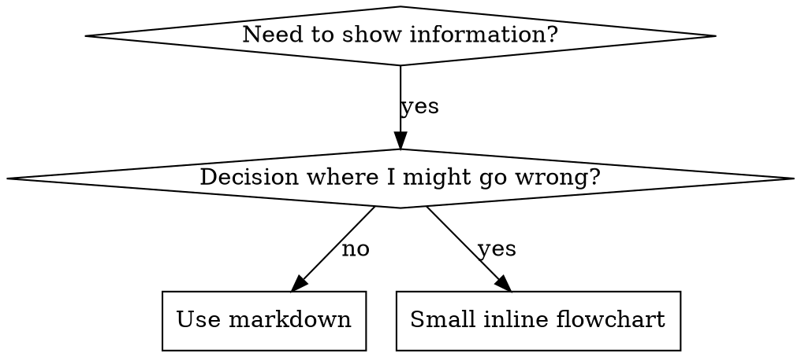

# Writing Skills

## Overview

**스킬 작성은 프로세스 문서에 적용한 테스트 주도 개발(TDD)이다.**

**스킬을 어디에 두는가**는 누가 쓰느냐로 갈린다.
나 혼자 쓰는 개인 스킬은 에이전트 실행 환경(Claude Code·Codex·Copilot CLI·Gemini CLI 같은 코딩 에이전트 제품)의 스킬 디렉터리에 둔다.
Claude Code는 `~/.claude/skills/`이고 다른 제품의 경로는 각 제품 문서를 따른다.
Codex, Copilot CLI, Gemini CLI는 제품을 가리지 않는 별칭으로 `~/.agents/skills/`도 인식한다.
플러그인으로 배포하는 스킬은 그 플러그인 저장소의 `skills/<이름>/`에 둔다.

테스트 케이스(서브에이전트를 쓴 압박 시나리오)를 먼저 쓰고 실패를 지켜보고(베이스라인 행동) 스킬(문서)을 쓰고 테스트가 통과하는지 지켜보고(에이전트가 준수) 리팩터한다(빈틈을 막는다).

**핵심 원칙:** 스킬 없이 에이전트가 실패하는 걸 지켜보지 않았다면, 그 스킬이 옳은 것을 가르치는지 알 수 없다.

**REQUIRED BACKGROUND:** 이 스킬을 쓰기 전에 groundwork:test-driven-development를 반드시 이해해야 한다.
그 스킬이 근본 RED-GREEN-REFACTOR 사이클을 정의한다.
이 스킬은 TDD를 문서에 적용한다.

**공식 가이드:** Anthropic의 공식 스킬 작성 베스트 프랙티스는 anthropic-best-practices.md를 참조한다.
그 문서는 이 스킬의 TDD 중심 접근을 보완하는 추가 패턴·가이드라인을 담는다.

## 스킬이란 무엇인가

**스킬**은 검증된 기법·패턴·도구의 레퍼런스 가이드다.
스킬은 후속 에이전트가 효과적인 접근을 찾아 적용하도록 돕는다.

**스킬인 것:** 재사용 가능한 기법·패턴·도구·레퍼런스 가이드

**스킬이 아닌 것:** 문제를 한 번 어떻게 풀었는지에 대한 서사

## 스킬을 위한 TDD 대응

| TDD 개념 | 스킬 작성 |
|-------------|----------------|
| **테스트 케이스** | 서브에이전트를 쓴 압박 시나리오 |
| **프로덕션 코드** | 스킬 문서(SKILL.md) |
| **테스트 실패(RED)** | 스킬 없이 에이전트가 규칙을 위반(베이스라인) |
| **테스트 통과(GREEN)** | 스킬이 있으면 에이전트가 준수 |
| **리팩터** | 준수를 유지하면서 빈틈을 막음 |
| **테스트 먼저 쓰기** | 스킬 쓰기 전에 베이스라인 시나리오 실행 |
| **실패를 지켜보기** | 에이전트가 쓴 합리화를 그대로 기록 |
| **최소 코드** | 그 위반만 겨냥한 스킬을 씀 |
| **통과를 지켜보기** | 이제 에이전트가 준수하는지 검증 |
| **리팩터 사이클** | 새 합리화 발견 → 막음 → 재검증 |

스킬 작성 과정 전체가 RED-GREEN-REFACTOR를 따른다.

## 스킬을 만들 때

**만든다:**
- 그 기법이 너에게 직관적으로 자명하지 않았다
- 프로젝트를 넘나들며 다시 참조할 것이다
- 패턴이 넓게 적용된다(프로젝트 한정이 아니다)
- 다른 사람도 이득을 본다

**만들지 않는다:**
- 일회성 해법
- 다른 곳에 잘 문서화된 표준 관행
- 프로젝트 한정 규약(지침 파일에 넣는다)
- 기계적 제약(regex·검증으로 강제할 수 있으면 자동화한다.
  문서는 판단이 필요한 경우에 남긴다)

## 스킬 유형

### 기법(Technique)
따라 할 단계가 있는 구체적 방법(condition-based-waiting, root-cause-tracing)

### 패턴(Pattern)
문제를 사고하는 방식(flatten-with-flags, test-invariants)

### 레퍼런스(Reference)
API 문서, 문법 가이드, 도구 사용법 문서

## 디렉터리 구조


```
skills/
  skill-name/
    SKILL.md              # Main reference (required)
    supporting-file.*     # Only if needed
```

**평평한 네임스페이스** - 모든 스킬이 하나의 검색 가능한 네임스페이스에 있다

**별도 파일로 분리:**
1. **무거운 레퍼런스**(100줄 이상) - API 문서, 포괄적 문법
2. **재사용 도구** - 스크립트, 유틸리티, 템플릿

**인라인으로 유지:**
- 원칙과 개념
- 코드 패턴(50줄 미만)
- 그 밖의 모든 것

## 이 스킬의 입력과 출력

**입력**: 쓰거나 고칠 대상 스킬을 받는다.
신규면 스킬 이름과 그것이 다룰 기법을, 편집이면 대상 `SKILL.md`의 경로를 호출자에게 받는다.
둘 다 받지 못했으면 무엇을 쓸지 사용자에게 묻는다.

**출력**: 위 「스킬을 어디에 두는가」가 정한 위치에 만든 `SKILL.md`와 그 참조 파일이다.
아래 「스킬 작성 체크리스트」를 통과하면 끝이고 다음 스킬로 자동으로 넘기지 않는다.

## 실행 계약 (쓰는 스킬에 담아야 할 것)

스킬 문서는 읽히는 것이 아니라 실행된다.
아래 항목 중 하나라도 없으면 그 스킬의 첫 행동이 막힌다.
네가 쓰는 스킬마다 아래를 모두 채운다.

1. **입력**: 그 스킬이 무엇을 받는가.
   대상 파일 경로·인자를 호출자가 넘기는지 스스로 찾는지, 찾는다면 어떤 규칙인지, 받지 못했을 때 무엇을 하는지.
2. **경로 기준**: 그 문서가 적은 상대 경로의 기준 디렉터리. 스킬은 플러그인 디렉터리에 설치되고 실행 시점 작업 디렉터리는 사용자 프로젝트다.
   기준을 밝히지 않으면 적힌 그대로 Read해서 실패한다.
   플러그인 안의 파일을 가리킬 때는 `${CLAUDE_PLUGIN_ROOT}` 기준으로 적는다.
3. **주체**: 그 문서를 실행하는 것이 누구인지, 문서가 쓰는 다른 역할 이름(저자·메인·컨트롤러·리뷰어 등)과 어떤 관계인지. 실행자가 자기 역할을 특정하지 못하면 어느 지시를 자기 몫으로 볼지 정할 수 없다.
4. **출력**: 그 스킬이 무엇을 반환하고 어디로 넘기는가.
   다음 단계로 넘긴다면 그 대상.

그 스킬이 셸 블록을 담으면 다음을 더 밝힌다.
블록이 쓰는 변수가 문서 안에서 대입되는지, 여러 블록이 상태를 공유한다면 같은 셸에서 도는 전제인지.

**REQUIRED SUB-SKILL**: 스킬 본문을 쓰기 전에 `groundwork:writing-for-junior`(맥락 없는 주니어 독자 기준의 작성 규범과 판정 렌즈)를 로드한다.
그 스킬의 `delta-skill.md`가 위 항목을 판정 축으로 갖는다.

이 문서 자신의 경로 기준도 같은 규칙을 따른다.
아래에서 파일명만 적은 참조는 이 스킬 디렉터리 `${CLAUDE_PLUGIN_ROOT}/skills/writing-skills/` 기준이고 `${CLAUDE_PLUGIN_ROOT}`는 groundwork 플러그인이 설치된 디렉터리이지 실행 시점 작업 디렉터리가 아니다.

## SKILL.md 구조

**Frontmatter (YAML):**
- 필수 필드 둘: `name`과 `description`(지원 필드 전체는 [agentskills.io/specification](https://agentskills.io/specification) 참조)
- 총 1024자 이하
- `name`: 문자·숫자·하이픈만 쓴다(괄호·특수문자 없음)
- `description`: 3인칭, **언제 쓰는가만** 서술한다(무엇을 하는지는 쓰지 않는다)
  - "Use when..."으로 시작해 트리거 조건에 집중한다
  - 구체적 증상·상황·맥락을 담는다
  - **스킬의 프로세스나 워크플로를 절대 요약하지 않는다**(이유는 아래 「스킬 탐색 최적화 (SDO, Skill Discovery Optimization)」 절 참조)
  - 가능하면 500자 이하로 유지한다

```markdown
---
name: <skill-name>
description: Use when [specific triggering conditions and symptoms]
---

# Skill Name

## Overview
What is this? Core principle in 1-2 sentences.

## When to Use
[Small inline flowchart IF decision non-obvious]

Bullet list with SYMPTOMS and use cases
When NOT to use

## Core Pattern (for techniques/patterns)
Before/after code comparison

## Quick Reference
Table or bullets for scanning common operations

## Implementation
Inline code for simple patterns
Link to file for heavy reference or reusable tools

## Common Mistakes
What goes wrong + fixes

## Real-World Impact (optional)
Concrete results
```


## 스킬 탐색 최적화 (SDO, Skill Discovery Optimization)

**탐색에 결정적:** 후속 에이전트가 네 스킬을 찾아야 한다

### 1. 풍부한 description 필드

**목적:** 에이전트는 주어진 작업에 어떤 스킬을 로드할지 정하려고 description을 읽는다.
"지금 이 스킬을 읽어야 하나?"에 답하게 만든다.

**형식:** "Use when..."으로 시작해 트리거 조건에 집중한다

**핵심: description = 언제 쓰는가, 스킬이 무엇을 하는가가 아니다**

description은 트리거 조건만 서술해야 한다.
스킬의 프로세스나 워크플로를 description에 요약하지 마라.

**왜 중요한가:** 테스트로 드러난 사실이다.
description이 스킬의 워크플로를 요약하면, 에이전트는 스킬 본문 전체를 읽는 대신 description을 따를 수 있다.
"태스크 사이 코드 리뷰"라고 적힌 description은 에이전트가 리뷰를 한 번만 하게 만들었다.
스킬의 플로차트는 리뷰 두 번(스펙 준수 다음 코드 품질)을 분명히 보여 줬는데도 그랬다.

description을 "Use when executing implementation plans with independent tasks"(워크플로 요약 없음)로 바꾸자, 에이전트는 플로차트를 제대로 읽고 2단계 리뷰 프로세스를 따랐다.

**함정:** 워크플로를 요약하는 description은 에이전트가 택할 지름길을 만든다.
스킬 본문은 에이전트가 건너뛰는 문서가 된다.

```yaml
# ❌ BAD: Summarizes workflow - agents may follow this instead of reading skill
description: Use when executing plans - dispatches subagent per task with code review between tasks

# ❌ BAD: Too much process detail
description: Use for TDD - write test first, watch it fail, write minimal code, refactor

# ✅ GOOD: Just triggering conditions, no workflow summary
description: Use when executing implementation plans with independent tasks in the current session

# ✅ GOOD: Triggering conditions only
description: Use when implementing any feature or bugfix, before writing implementation code
```

**내용:**
- 이 스킬이 적용됨을 알리는 구체적 트리거·증상·상황을 쓴다
- *언어별 증상*(setTimeout, sleep)이 아니라 *문제*(race condition, 일관되지 않은 동작)를 서술한다
- 스킬 자체가 기술 특정이 아니면 트리거를 기술 중립으로 쓴다
- 스킬이 기술 특정이면 트리거에 그 기술을 명시한다
- 3인칭으로 쓴다(시스템 프롬프트에 주입됨)
- **스킬의 프로세스나 워크플로를 절대 요약하지 않는다**

```yaml
# ❌ BAD: Too abstract, vague, doesn't include when to use
description: For async testing

# ❌ BAD: First person
description: I can help you with async tests when they're flaky

# ❌ BAD: Mentions technology but skill isn't specific to it
description: Use when tests use setTimeout/sleep and are flaky

# ✅ GOOD: Starts with "Use when", describes problem, no workflow
description: Use when tests have race conditions, timing dependencies, or pass/fail inconsistently

# ✅ GOOD: Technology-specific skill with explicit trigger
description: Use when using React Router and handling authentication redirects
```

### 2. 키워드 커버리지

에이전트가 검색할 단어를 쓴다:
- 에러 메시지: "Hook timed out", "ENOTEMPTY", "race condition"
- 증상: "flaky", "hanging", "zombie", "pollution"
- 동의어: "timeout/hang/freeze", "cleanup/teardown/afterEach"
- 도구: 실제 명령, 라이브러리명, 파일 타입

### 3. 서술형 이름

**능동태, 동사 우선을 쓴다:**
- 좋음: `creating-skills`, `skill-creation` 아님
- 좋음: `condition-based-waiting`, `async-test-helpers` 아님

**하는 일이나 핵심 통찰로 이름 짓는다:**
- 좋음: `condition-based-waiting` > `async-test-helpers`
- 좋음: `using-skills`, `skill-usage` 아님
- 좋음: `flatten-with-flags` > `data-structure-refactoring`
- 좋음: `root-cause-tracing` > `debugging-techniques`

**동명사(-ing)는 프로세스에 잘 맞는다:**
- `creating-skills`, `testing-skills`, `debugging-with-logs`
- 능동적이고 네가 취하는 행동을 서술한다


### 4. 토큰 효율 (결정적)

**문제:** 모든 세션에 주입되는 진입 스킬(groundwork에서는 `using-groundwork`)과 자주 참조되는 스킬은 모든 대화에 로드된다.
토큰 하나하나가 중요하다.

**목표 단어 수:**
- 모든 세션에 주입되는 진입 스킬의 워크플로: 각 150단어 미만
- 자주 로드되는 스킬: 총 200단어 미만
- 그 밖의 스킬: 500단어 미만(그래도 간결하게)

**기법:**

**세부는 도구 help로 옮긴다:**
```bash
# ❌ BAD: Document all flags in SKILL.md
search-conversations supports --text, --both, --after DATE, --before DATE, --limit N

# ✅ GOOD: Reference --help
search-conversations supports multiple modes and filters. Run --help for details.
```

**cross-reference를 쓴다:**
```markdown
# ❌ BAD: Repeat workflow details
When searching, dispatch subagent with template...
[20 lines of repeated instructions]

# ✅ GOOD: Reference other skill
Always use subagents (50-100x context savings). REQUIRED: Use [other-skill-name] for workflow.
```

**예시를 압축한다:**
```markdown
# ❌ BAD: Verbose example (42 words)
your human partner: "How did we handle authentication errors in React Router before?"
You: I'll search past conversations for React Router authentication patterns.
[Dispatch subagent with search query: "React Router authentication error handling 401"]

# ✅ GOOD: Minimal example (20 words)
Partner: "How did we handle auth errors in React Router?"
You: Searching...
[Dispatch subagent → synthesis]
```

**중복을 없앤다:**
- cross-reference된 스킬에 있는 내용을 반복하지 않는다
- 명령으로 자명한 것을 설명하지 않는다
- 같은 패턴의 예시를 여러 개 넣지 않는다

**검증:**
```bash
wc -w skills/path/SKILL.md
# getting-started workflows: aim for <150 each
# Other frequently-loaded: aim for <200 total
```

### 5. 다른 스킬 cross-reference

**다른 스킬을 참조하는 문서를 쓸 때:**

스킬 이름만 쓰고 요구 마커를 명시한다:
- 좋음: `**REQUIRED SUB-SKILL:** Use groundwork:test-driven-development`
- 좋음: `**REQUIRED BACKGROUND:** You MUST understand groundwork:systematic-debugging`
- 나쁨: `See skills/testing/test-driven-development`(필수인지 불분명)
- 나쁨: `@skills/testing/test-driven-development/SKILL.md`(강제 로드, 컨텍스트 낭비)

**왜 @ 링크를 쓰지 않나:** `@` 문법은 파일을 즉시 강제 로드해, 필요하기 전에 200k 넘는 컨텍스트를 소비한다.

## 플로차트 사용



**플로차트는 다음에만 쓴다:**
- 자명하지 않은 결정 지점
- 너무 일찍 멈출 수 있는 프로세스 루프
- "A 대 B 언제 쓰나" 결정

**플로차트를 절대 쓰지 않는 곳:**
- 레퍼런스 자료 → 표, 목록
- 코드 예시 → 마크다운 블록
- 선형 지시 → 번호 목록
- 의미 없는 라벨(step1, helper2)

graphviz 스타일 규칙은 `${CLAUDE_PLUGIN_ROOT}/skills/writing-skills/graphviz-conventions.dot`을 참조한다.

**사용자에게 시각화:** `${CLAUDE_PLUGIN_ROOT}/skills/writing-skills/render-graphs.js`로 스킬의 플로차트를 SVG로 렌더한다.
인자는 렌더 대상 스킬의 디렉터리 경로다.
```bash
${CLAUDE_PLUGIN_ROOT}/skills/writing-skills/render-graphs.js <대상 스킬 디렉터리>           # 다이어그램마다 따로
${CLAUDE_PLUGIN_ROOT}/skills/writing-skills/render-graphs.js <대상 스킬 디렉터리> --combine # 전부 한 SVG로
```

## 코드 예시

**훌륭한 예시 하나가 그저 그런 예시 여럿을 이긴다**

가장 관련 있는 언어를 고른다:
- 테스팅 기법 → TypeScript/JavaScript
- 시스템 디버깅 → Shell/Python
- 데이터 처리 → Python

**좋은 예시:**
- 완결적이고 실행 가능
- WHY를 설명하는 주석이 잘 달림
- 실제 시나리오에서 옴
- 패턴을 분명히 보여 줌
- 바로 적용 가능(일반 템플릿이 아님)

**하지 마라:**
- 5개 이상 언어로 구현
- 빈칸 채우기 템플릿 작성
- 억지 예시 작성

너는 포팅을 잘한다.
훌륭한 예시 하나면 충분하다.

## 파일 조직

### 자기완결 스킬
```
defense-in-depth/
  SKILL.md    # Everything inline
```
언제: 모든 내용이 들어가고 무거운 레퍼런스가 필요 없을 때

### 재사용 도구가 딸린 스킬
```
condition-based-waiting/
  SKILL.md    # Overview + patterns
  example.ts  # Working helpers to adapt
```
언제: 도구가 서사가 아니라 재사용 코드일 때

### 무거운 레퍼런스가 딸린 스킬
```
pptx/
  SKILL.md       # Overview + workflows
  pptxgenjs.md   # 600 lines API reference
  ooxml.md       # 500 lines XML structure
  scripts/       # Executable tools
```
언제: 레퍼런스 자료가 인라인으로 두기엔 너무 클 때

## Iron Law (TDD와 동일)

```
NO SKILL WITHOUT A FAILING TEST FIRST
```

이것은 새 스킬 **그리고** 기존 스킬 편집에 적용된다.

스킬을 테스트 전에 썼다?
지운다.
처음부터 다시.
스킬을 테스트 없이 편집했다?
같은 위반이다.

**예외 없다:**
- "간단한 추가"도 아니다
- "그냥 섹션 하나 추가"도 아니다
- "문서 업데이트"도 아니다
- 테스트 안 한 변경을 "참고용"으로 남기지 마라
- 테스트를 돌리면서 "손보지" 마라
- 지운다는 건 지운다는 뜻이다

**REQUIRED BACKGROUND:** groundwork:test-driven-development 스킬이 이것이 왜 중요한지 설명한다.
같은 원칙이 문서에 적용된다.

## 모든 스킬 유형 테스트하기

스킬 유형이 다르면 테스트 접근도 다르다:

### 규율 강제 스킬 (규칙·요구)

**예:** TDD, verification-before-completion, designing-before-coding

**테스트 방법:**
- 학술 질문: 규칙을 이해하는가?
- 압박 시나리오: 스트레스 속에서 준수하는가?
- 복합 압박: 시간 + 매몰 비용 + 탈진
- 합리화를 식별해 명시적 반박을 추가

**성공 기준:** 최대 압박 속에서 에이전트가 규칙을 따른다

### 기법 스킬 (how-to 가이드)

**예:** condition-based-waiting, root-cause-tracing, defensive-programming

**테스트 방법:**
- 적용 시나리오: 기법을 올바로 적용하는가?
- 변형 시나리오: 엣지케이스를 다루는가?
- 정보 누락 테스트: 지시에 빈틈이 있는가?

**성공 기준:** 에이전트가 새 시나리오에 기법을 성공적으로 적용한다

### 패턴 스킬 (멘탈 모델)

**예:** reducing-complexity, information-hiding 개념

**테스트 방법:**
- 인식 시나리오: 패턴이 적용될 때를 인식하는가?
- 적용 시나리오: 멘탈 모델을 쓸 수 있는가?
- 반례: 적용하지 **않을** 때를 아는가?

**성공 기준:** 에이전트가 패턴을 언제·어떻게 적용할지 올바로 식별한다

### 레퍼런스 스킬 (문서·API)

**예:** API 문서, 명령 레퍼런스, 라이브러리 가이드

**테스트 방법:**
- 검색 시나리오: 올바른 정보를 찾는가?
- 적용 시나리오: 찾은 것을 올바로 쓰는가?
- 갭 테스트: 흔한 사용례가 커버되는가?

**성공 기준:** 에이전트가 레퍼런스 정보를 찾아 올바로 적용한다

## 테스트 건너뛰기의 흔한 합리화

| 핑계 | 현실 |
|--------|---------|
| "스킬이 명백히 명확하다" | 나에게 명확 ≠ 다른 에이전트에게 명확. 테스트하라. |
| "그냥 레퍼런스일 뿐" | 레퍼런스에도 빈틈·불명확한 부분이 있다. 검색을 테스트하라. |
| "테스트는 과잉이다" | 테스트 안 한 스킬엔 문제가 있다. 언제나. 15분 테스트가 몇 시간을 아낀다. |
| "문제 생기면 테스트하겠다" | 문제 = 에이전트가 스킬을 못 쓴다. 배포 전에 테스트하라. |
| "테스트가 너무 지루하다" | 테스트는 프로덕션에서 나쁜 스킬 디버깅보다 덜 지루하다. |
| "좋다고 확신한다" | 과신이 문제를 보장한다. 그래도 테스트하라. |
| "학술 검토로 충분하다" | 읽기 ≠ 쓰기. 적용 시나리오를 테스트하라. |
| "테스트할 시간이 없다" | 테스트 안 한 스킬 배포가 나중에 고치는 데 더 많은 시간을 쓴다. |

**이 모두가 뜻하는 것: 배포 전에 테스트하라.
예외 없다.**

## 형식을 실패에 맞춘다

규칙 문구를 쓰기 전에 베이스라인 실패를 분류하라.
한 실패 유형을 방탄으로 만드는 형식이 다른 유형에는 측정 가능하게 역효과를 낸다.

| 베이스라인 실패 | 맞는 형식 | 틀린 형식 |
|---|---|---|
| 압박 속에서 규칙을 건너뛰거나 위반(더 잘 알면서도 그냥 한다) | 금지 + 합리화 표 + Red Flags(아래 「합리화에 맞선 스킬 방탄화」 참조) | 부드러운 가이드("~를 선호하라", "~를 고려하라") |
| 준수하지만 출력의 형태가 틀림(부푼 프롬프트, 묻힌 판정, 스펙 재서술) | 긍정 레시피나 계약: 출력이 무엇**인지** 명시(부분들을 순서대로) | 금지 목록("재서술하지 마라", "서술하지 마라") |
| 이미 만드는 것에서 필수 요소를 누락 | 구조적: 채워 넣는 템플릿의 REQUIRED 필드나 슬롯 | 템플릿 근처의 산문 알림 |
| 동작이 조건에 따라 달라져야 함 | 관측 가능한 술어에 건 조건문("brief가 있으면 참조하라") | 무조건 규칙 + 예외 조항 |

**왜 금지가 형태 문제에 역효과인가:** 경쟁 인센티브("프롬프트를 자기완결로 만들어라") 아래서 에이전트는 "X 하지 마라"와 협상한다.
서브에이전트 디스패치 프롬프트 작성 규칙을 대상으로 한 문구 테스트에서, 금지 방식은 레시피 방식보다 원치 않는 내용을 뚜렷이 더 많이 만들었고(분포가 완전히 분리됨), 규칙 문구가 없는 대조군보다도 나빴다.
기본으로 금지에 손대지 말고 자기 사례를 직접 마이크로 테스트하라(아래 「전체 시나리오 전에 문구를 마이크로 테스트한다」).
레시피는 협상할 여지를 남기지 않는다.
출력이 명시된 형태에 맞거나 안 맞거나 둘 중 하나다.

**어느 형식을 고르든 지킬 규칙:**
- **뉘앙스 조항 없음.** "중요하면 X 하지 마라"는 협상을 다시 연다.
  이긴 레시피에 뉘앙스 조항을 하나 붙이자 같은 문구 테스트에서 일관되던 것이 불안정해졌다.
  진짜 예외는 관측 가능한 술어에 건 자체 조건문으로 표현하라.
- **예외 조항은 범위를 못 좁힌다.**
  "이 제한은 코드 블록에 적용되지 않는다"는 여전히 코드 블록을 억누른다.
  출력의 일부가 면제돼야 하면, 규칙이 거기 닿지 못하게 구조를 다시 짜라.

## 합리화에 맞선 스킬 방탄화

규율을 강제하는 스킬(TDD 같은)은 합리화에 저항해야 한다.
에이전트는 똑똑하고 압박받으면 빈틈을 찾아낸다.

**범위:** 이 도구모음은 규율 실패용이다.
규칙을 알면서 압박 속에 건너뛰는 에이전트 말이다.
형태가 틀린 출력이나 누락된 요소에는 금지 기반 방탄화가 역효과다.
「형식을 실패에 맞춘다」의 형식을 쓰라.

**심리 노트:** 설득 기법이 왜 통하는지 이해하면 그것을 체계적으로 적용할 수 있다.
연구 근거(Cialdini 2021, Meincke et al. 2025)의 authority, commitment, scarcity, social proof, unity 원칙은 persuasion-principles.md를 참조한다.

### 모든 빈틈을 명시적으로 막는다

규칙을 진술만 하지 말고 구체적 우회를 금지하라:

**나쁨:**
```markdown
Write code before test? Delete it.
```

**좋음:**
```markdown
Write code before test? Delete it. Start over.

**No exceptions:**
- Don't keep it as "reference"
- Don't "adapt" it while writing tests
- Don't look at it
- Delete means delete
```

### "정신 대 문구" 논변에 대응한다

근본 원칙을 일찍 넣는다:

```markdown
**Violating the letter of the rules is violating the spirit of the rules.**
```

이것은 "나는 정신을 따르고 있다" 부류의 합리화 전체를 끊는다.

### 합리화 표를 만든다

베이스라인 테스트에서 나온 합리화를 잡는다(아래 테스트 절 참조).
에이전트가 대는 모든 핑계가 표에 들어간다:

```markdown
| Excuse | Reality |
|--------|---------|
| "Too simple to test" | Simple code breaks. Test takes 30 seconds. |
| "I'll test after" | Tests passing immediately prove nothing. |
| "Tests after achieve same goals" | Tests-after = "what does this do?" Tests-first = "what should this do?" |
```

### Red Flags 목록을 만든다

에이전트가 합리화 중일 때 스스로 점검하기 쉽게 만든다:

```markdown
## Red Flags - STOP and Start Over

- Code before test
- "I already manually tested it"
- "Tests after achieve the same purpose"
- "It's about spirit not ritual"
- "This is different because..."

**All of these mean: Delete code. Start over with TDD.**
```

### 위반 증상으로 SDO를 업데이트한다

규칙을 위반하기 **직전**의 증상을 description에 추가한다:

```yaml
description: use when implementing any feature or bugfix, before writing implementation code
```

## 스킬을 위한 RED-GREEN-REFACTOR

TDD 사이클을 따른다:

### RED: 실패하는 테스트 작성(베이스라인)

스킬 **없이** 서브에이전트로 압박 시나리오를 돌린다.
정확한 행동을 기록한다:
- 어떤 선택을 했나?
- 어떤 합리화를 썼나(그대로)?
- 어떤 압박이 위반을 유발했나?

이것이 "테스트가 실패하는 걸 지켜보기"다.
스킬을 쓰기 전에 에이전트가 자연스럽게 무엇을 하는지 봐야 한다.

### GREEN: 최소 스킬 작성

그 구체적 합리화를 겨냥한 스킬을 쓴다.
가상의 경우를 위한 추가 내용을 넣지 않는다.

같은 시나리오를 스킬과 **함께** 돌린다.
이제 에이전트가 준수해야 한다.

### REFACTOR: 빈틈 막기

에이전트가 새 합리화를 찾았나?
명시적 반박을 추가한다.
방탄이 될 때까지 재테스트한다.

### 전체 시나리오 전에 문구를 마이크로 테스트한다

전체 압박 시나리오 실행이 최종 관문이지만 반복당 느리고 비싸다.
문구 자체를 먼저 마이크로 테스트로 검증하라:

1. **호출당 fresh 컨텍스트 샘플 하나** - 원시 API 호출, 또는 API 접근이 없으면 단발 서브에이전트. 시스템 프롬프트 = 그 규칙 문구가 실제로 놓일 컨텍스트(문구만 떼어내지 말고 스킬 본문과 프롬프트 템플릿 전체를 넣는다), 유저 메시지 = 그 실패를 유혹하는 작업.
2. **항상 규칙 문구가 없는 대조군을 포함하라.**
   대조군이 그 실패를 안 보이면, 고칠 게 없다.
   멈추고 문구를 쓰지 마라.
3. **변형마다 5회 이상 반복.** 단일 샘플은 거짓말한다.
4. **플래그된 매치를 하나하나 직접 읽어라.**
   프로그램으로 채점해도 좋지만 템플릿 반향과 인용된 반례가 히트로 위장한다.
   자동 카운트만으로는 실패와 성공을 모두 과장한다.
5. **분산이 지표다.**
   규칙 문구가 안착하면 반복들이 같은 형태로 수렴한다.
   5회에서 5가지 해석이 나오면 문구가 구속력이 없는 것이다.
   단어를 더하기 전에 형식을 조이라.

마이크로 테스트는 문구를 검증한다.
규율 스킬의 압박 시나리오를 대체하지는 않는다.

**테스트 방법론:** 완전한 테스트 방법론은 [testing-skills-with-subagents.md](testing-skills-with-subagents.md)를 참조한다:
- 압박 시나리오 쓰는 법
- 압박 유형(시간, 매몰 비용, 권위, 탈진)
- 빈틈을 체계적으로 막기
- 메타 테스트 기법

## 안티패턴

### 나쁨: 서사적 예시
"2025-10-03 세션에서 빈 projectDir가 ~를 유발했다..."
**왜 나쁜가:** 너무 구체적이라 재사용 불가

### 나쁨: 다언어 희석
example-js.js, example-py.py, example-go.go **왜 나쁜가:** 품질이 그저 그렇고 유지보수 부담

### 나쁨: 플로차트 속 코드
```dot
step1 [label="import fs"];
step2 [label="read file"];
```
**왜 나쁜가:** 복사-붙여넣기 불가, 읽기 어려움

### 나쁨: 일반 라벨
helper1, helper2, step3, pattern4 **왜 나쁜가:** 라벨엔 의미가 있어야 한다

## STOP: 다음 스킬로 넘어가기 전에

**어떤 스킬이든 쓴 뒤, 반드시 멈춰 배포 프로세스를 완료해야 한다.**

**하지 마라:**
- 각각을 테스트하지 않고 여러 스킬을 일괄 생성
- 현재 스킬이 검증되기 전에 다음 스킬로 이동
- "일괄이 더 효율적"이라며 테스트를 건너뜀

**아래 배포 체크리스트는 스킬 하나하나에 필수다.**

테스트 안 한 스킬 배포 = 테스트 안 한 코드 배포. 품질 기준 위반이다.

## 스킬 작성 체크리스트 (TDD 적용)

**중요: 아래 체크리스트 항목마다 todo를 만든다.**

**RED 단계 - 실패하는 테스트 작성:**
- [ ] 압박 시나리오 작성(규율 스킬은 복합 압박 3개 이상)
- [ ] 스킬 없이 시나리오 실행 - 베이스라인 행동을 그대로 기록
- [ ] 합리화·실패의 패턴 식별

**GREEN 단계 - 최소 스킬 작성:**
- [ ] 이름은 문자·숫자·하이픈만(괄호·특수문자 없음)
- [ ] 필수 `name`·`description` 필드를 갖춘 YAML frontmatter(1024자 이하, [spec](https://agentskills.io/specification) 참조)
- [ ] description이 "Use when..."으로 시작하고 구체적 트리거·증상 포함
- [ ] description을 3인칭으로 작성
- [ ] 검색용 키워드를 곳곳에(에러, 증상, 도구)
- [ ] 핵심 원칙이 담긴 명확한 개요
- [ ] RED에서 식별한 구체적 베이스라인 실패에 대응
- [ ] 규칙 문구의 형식이 실패 유형에 맞음(「형식을 실패에 맞춘다」 참조)
- [ ] 행동을 형성하는 규칙 문구는 대조군과 함께 마이크로 테스트(5회 이상, 플래그된 매치 하나하나 직접 읽음) - 순수 레퍼런스 스킬은 해당 없음
- [ ] 코드 인라인 또는 별도 파일 링크
- [ ] 훌륭한 예시 하나(다언어 아님)
- [ ] 스킬과 함께 시나리오 실행 - 이제 에이전트가 준수하는지 검증

**REFACTOR 단계 - 빈틈 막기:**
- [ ] 테스트에서 나온 **새** 합리화 식별
- [ ] 명시적 반박 추가(규율 스킬이면)
- [ ] 모든 테스트 반복에서 나온 합리화로 표 구성
- [ ] Red Flags 목록 작성
- [ ] 방탄이 될 때까지 재테스트

**품질 점검:**
- [ ] 결정이 자명하지 않을 때만 작은 플로차트
- [ ] 빠른 참조 표
- [ ] 흔한 실수 섹션
- [ ] 서사적 스토리텔링 없음
- [ ] 지원 파일은 도구나 무거운 레퍼런스에만

**배포:**
- [ ] 스킬을 git에 커밋

## 탐색 워크플로

후속 에이전트가 네 스킬을 찾는 법:

1. **문제를 만난다**("테스트가 flaky하다")
2. **스킬을 검색한다**(description을 grep, 카테고리를 훑음)
3. **SKILL을 찾는다**(description이 매칭)
4. **개요를 훑는다**(관련 있나?)
5. **패턴을 읽는다**(빠른 참조 표)
6. **예시를 로드한다**(구현할 때만)

**이 흐름에 최적화하라** - 검색 가능한 용어를 앞에, 자주 둔다.
